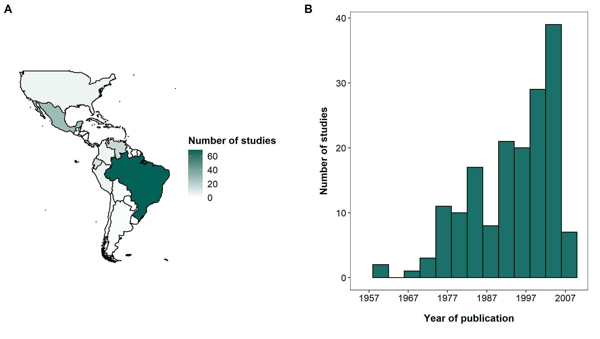
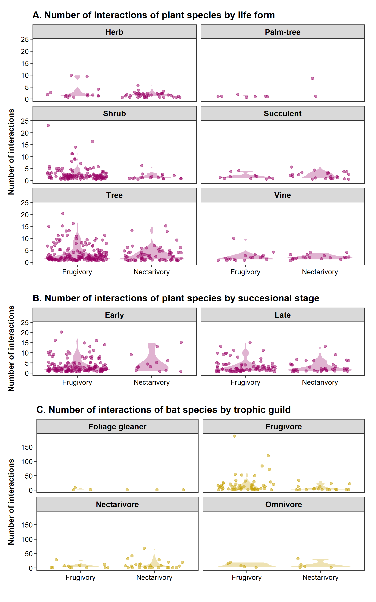
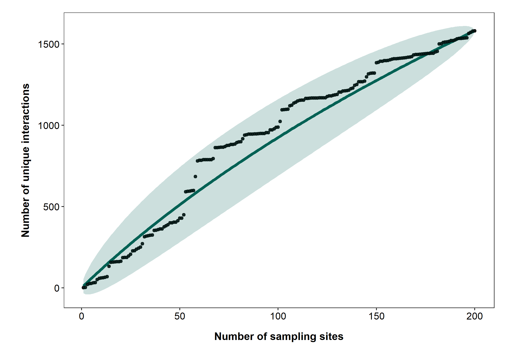

> > *1 Universidade Federal do ABC (UFABC). Centro de Ciências Humanas e Naturais. 09210-580 Santo André, SP, Brazil.*
> >
> > *2 Massey University. Molecular Epidemiology and Public Health Laboratory, Hopkirk Research Institute. 4442. Palmerston North, New Zealand*
> >
> > *3 Universidade Federal Rural do Rio de Janeiro (UFRRJ). Instituto de Biologia, Laboratório de Mastozoologia. 23890-000 Seropédica, RJ, Brazil.*
> >
> > *4 Bat Conservation International, Austin, TX, USA*
> >
> > *5 Department of Biology and Burke Museum of Natural History and Culture, University of Washington, Seattle, WA, 98195, USA*
> >
> > *6 Department of Natural Resources Management and Museum of Texas Tech University, Lubbock, TX, USA*
> >
> > *7 Institute of Evolutionary Ecology and Conservation Genomics, Ulm University, Ulm, Germany*
> >
> > *8 Universidade de São Paulo. Departamento de Matemática Aplicada e Estatística, Instituto de Ciências Matemáticas e de Computação. 13560-970 São Carlos, SP, Brazil*
> >
> > *9 Universidade de São Paulo (USP), Instituto de Biociências, Departamento de Ecologia Geral. 05508-090 São Paulo, SP, Brazil.*  

> > \*Corresponding author: Guillermo L. Florez-Montero ([gflorezmontero\@gmail.com](mailto:gflorezmontero@gmail.com){.email})\*

 

```{r processing data, code=readLines("chunk_1.R"), message=FALSE, warning=FALSE, include=FALSE}
```

# INTRODUCTION

 

Open access to primary scientific data is fundamental to enforce the social contract that governs scientific publishing [@vision2010]. This contract relies on transparency and reproducibility, including independent verification and reuse of published data [@costello2009]. This way, data access has been facilitated in the information age through important frameworks for the production, storage, curation, and sharing of data. These frameworks aim to preserve data in the long term, even beyond the life of their initial compilers and curators [@chavan2009].

 

One major framework for making data available are data papers, which optimize efforts in the discovery, organization, and availability of information [@chavan2011]. They have the potential to offer highly reliable data sources, as they have been subjected to quality control protocols, such as peer review and editorial inspection of data and metadata [@costello2013].
By introducing additional incentives related to publication and citation, this new kind of publication has revolutionized contemporary biology by making decades of naturalistic information widely available in highly accessible and comprehensive formats.

 

Recently, the data paper revolution has also reached mammalogy.
Data papers on mammal communities are growing in number.
There are, for instance, data papers on non-volant mammals on a global scale [@thibault2011]. Another important source is the BioTIME database of biodiversity time series for the Anthropocene [@dornelas2018]. Others have larger scope, such as the global database for metacommunity ecology, integrating species, traits, environments, and space [@jeliazkov2020].
Others attempt to harmonize and curate all main data sets for mammal traits, phyllogeny, and viral sharing (<https://github.com/viralemergence/clover>).

 

In Brazil, the most famous mammalogical data papers were produced by the ATLANTIC Series and NEOTROPICAL Series, which contain information about the biodiversity of the Atlantic Forest of South America and the Neotropics, respectively.
This series includes data papers on plant-frugivore interactions [@bello2017], rodents and marsupials: [@bovendorp2017], bats [@muylaert2017], primates [@culot2019], and medium- and large-sized mammals [@souza2019]. Many other data papers were produced by other research groups outside the ATLANTIC Series, focusing on groups such as small mammals [@figueredo2017]. Nevertheless, only a few of them covered larger spatial scales, such as Neotropical xenarthrans [@santos2019] and Neotropical Carnivores [@Nagy-Reis2020].
In addition, most of them, particularly in the Atlantic Forest and Cerrado, are based on abundance-incidence data whereas species interactions received much less attention.

 

Mutualistic interactions between animals and plants are a cornerstone of terrestrial ecosystems.
Almost 94% of plants in neotropical communities are pollinated by animals [@ollerton2011], while 70--94% have their seeds dispersed by vertebrates [@jordano2013]. Bats are especially important in this context, as they represent the second largest group of seed dispersers in the Neotropics, after birds [@bello2017]. On the other hand, even though insects pollinate most flowering plants, bats are also the second group of pollinating vertebrates since they pollinate about 2% of the extant plant genera [@skercioglu2006]. Bat-plant interactions also generate ecosystem services, such as the pollination of economically important plants and the dispersal of seeds from pioneer plants that are key to habitat regeneration [@kunz2011].

 

Therefore, bats and their food-plants are the focus of our data paper.
We compiled a georeferenced database of `r nrow(records)` interaction records of frugivory and nectarivory between `r n_bats` bat species and `r n_plants` plant species.
The data came from `r nrow(references)` studies covering `r nrow(sites)` locations in `r nrow(countries)` countries all over the Neotropical region (Figure 1).
The database compiled by @geiselman2002 was used as a starting point and was filtered, revised, and updated.
We added mainly new literature, specially from South America.

After this update, NeoBat Interactions is so far the most extensive bat-plant interaction database both in geographic and taxonomic terms.
Most sampling sites are georeferenced with high coordinate accuracy.
All records came from primary sources and were taxonomically verified and updated.
Besides, our database includes some geographic and abiotic information of study sites such as vegetation type and rainfall.
Our database also includes ecological information for most species, such as a life form and successional stage of plants, and trophic guild of bats.
The data are organized and standardized at different levels of ecological complexity and temporal and geographic scales, which allows using them in a variety of studies with different scopes.

```{r Fig 1, echo=FALSE, out.width="90%", fig.align ="center", fig.pos = "!t", fig.cap="Distribution of sampling sites included in NeoBat Interactions. Dots show the location of original studies focused on plant visitation (purple) and bat diet (yellow). White lines show country borders. We included only studies with records of bat-plant interactions that were confirmed either by indirect or direct observation."}

knitr::include_graphics("../Figures/Figure_1.png")

```

\clearpage

# METADATA

 

## CLASS I. DATA SET DESCRIPTORS

 

### A. Data set identity

> **Title:** NeoBat Interactions: a data set of bat-plant interactions in the Neotropics  

### B. Data set identification

> **Data set identity codes:**
>
> NeoBat_Interactions_References.csv
>
> NeoBat_Interactions_Sites.csv
>
> NeoBat_Interactions_Records.csv  

### C. Data set description

> **Principal Investigator(s):**
>
> 1.  Guillermo L. Florez-Montero.
>     Universidade Federal do ABC.
>     Centro de Ciências Humanas e Naturais.
>     09210-580 Santo André, SP, Brazil.
>
> 2.  Marco A. R. Mello.
>     Universidade de São Paulo, Instituto de Biociências, Departamento de Ecologia.
>     05508-090 São Paulo, SP, Brazil.
>      

> **Abstract:**
>
> Data papers and open databases revolutionized contemporary science, as they provide the long-needed incentive to collaborate in large international teams and make naturalistic information widely available.
> Nevertheless, most of them focus on occurrence or abundance, while species interactions received much less attention.
> To help fill this gap, we compiled a georeferenced data set of interactions between `r n_bats` bat species of the family Phyllostomidae (Chiroptera) and `r n_plants` plant species of `r n_plantfam` families.
> Data came from `r nrow(references)` studies published from `r min(references$Year)` to `r max(references$Year)` in the entire Neotropical Region, with most records from `r countries[1,1]` (`r countries[1,3]`% of all study sites), `r countries[2,1]` (`r countries[2,3]`%), and `r countries[3,1]` (`r countries[3,3]`%).
> Our data set includes `r nrow(records)` records of frugivory (`r interaction_type[1,2]`% of all records) and nectarivory (`r interaction_type[2,2]`%).
> The best represented bat genera are *`r batrecords[1,1]`* (`r batrecords[1,2]`% of all records), *`r batrecords[2,1]`* (`r batrecords[2,2]`%), *`r batrecords[3,1]`* (`r batrecords[3,2]`%), and *`r batrecords[4,1]`* (`r batrecords[4,2]`%).
> *`r batdegree[1,1]`* (`r batdegree[1,2]`), *`r batdegree[2,1]`* (`r batdegree[2,2]`), *`r batdegree[3,1]`* (`r batdegree[3,2]`), *`r batdegree[4,1]`* (`r batdegree[4,2]`), and *`r batdegree[5,1]`* (`r batdegree[5,2]`) are the bat species with the broadest diets recorded in number of plant species.
> Among plants, the best represented families are `r plantrecords[1,1]` (`r plantrecords[1,2]`%), `r plantrecords[2,1]` (`r plantrecords[2,2]`%), `r plantrecords[3,1]` (`r plantrecords[3,2]`%), and `r plantrecords[4,1]` (`r plantrecords[4,2]`%).
> Plants of the genera *`r plantdegree[1,1]`* (`r plantdegree[1,2]`), *`r plantdegree[2,1]`* (`r plantdegree[2,2]`), *`r plantdegree[3,1]`* (`r plantdegree[3,2]`), *`r plantdegree[4,1]`* (`r plantdegree[4,2]`), and *`r plantdegree[5,1]`* (`r plantdegree[5,2]`) hold the largest number of interactions.
> These data are stored as arrays (records, sites, and studies) organized by logical keys and rich metadata, which helps compile the information at different ecological and geographic scales, according to how they should be used.
> Our data set on bat-plant interactions is so far the most extensive both in geographic and taxonomic terms, and also includes some abiotic information of study sites and ecological information of plants and bats.
> It has already helped us develop several studies and we hope it will stimulate novel analyses and syntheses, in addition to pointing out to important gaps in knowledge.
>  

### D. Key words

  Databases, frugivory, mutualism, nectarivory, networks, pollination, seed dispersal, species interactions.

 

### E. Description

 

This database includes `r nrow(records)` records of interactions involving the consumption of nectar and fruits by bats, taken from studies focused on bat diets or plant visitation by bats across the Neotropics (Figure 1).
The information came from `r nrow(countries)` countries, from southwestern United States of America to northwestern Argentina.
We have compiled `r nrow(references)` scientific papers carried out over `r max(references$Year) - min(references$Year)` years, in `r nrow(sites)` study locations.
The spatial and temporal distribution of the studies is not heterogeneous.`r countries[1,1]` (`r countries[1,2]`), `r countries[2,1]` (`r countries[2,2]`), `r countries[3,1]` (`r countries[3,2]`) and `r countries[4,1]` (`r countries[4,2]`) are the countries where most studies have been carried out (Figure 2A).
Likewise, the number of studies on frugivory and nectarivory was low between the 1950s and the 1970s, peaking between the 1980s and the 2000s (Figure 2B).

```{r Figure 2, echo=FALSE, fig.align ="center", out.width="100%", fig.pos= "!ht", fig.cap="Distribution of the number of studies on frugivory and nectarivory by bats, published by country (A) and throughout the recorded period (B)."}



```

 

The best represented interaction type was frugivory (`r interaction_type[1,2]`% of all records) while nectarivory came second (`r interaction_type[2,2]`% of all records).
Although most data come from primarily fruit- and nectar-feeding bats, there are also interaction records of species from other trophic guilds that occasionally feed on fruit or nectar.
Likewise, this database includes information mainly on trees and shrubs, although it also contains other plant life forms such as vines and herbs.
Several plant species have no information on successional stage, but there are many classified as early successional species (Table 1).

We have also included information about interaction strength, nevertheless `r n_weight`% of the records have no such data, mainly because strengths were not reported in the source papers.
Regarding their conservation status, `r sum(batsiucn$Frequency_R[1:3])`% of the bat species and `r sum(plantsiucn$Frequency_R[1:4])`% of the plant species are listed in some category of threat according to the IUCN (Table 2).
However, most plant species (`r plantsiucn$Frequency_R[plantsiucn$Category == "Not Evaluated (NE)"]`%) and some bat species (`r batsiucn$Frequency_R[batsiucn$Category == "Not Evaluated (NE)"]`%) have not been listed in any category.

```{r table 1 and 2, echo=FALSE,  message=FALSE, warning=FALSE}
# add the table 1
all %>% 
  kableExtra::kbl(booktabs = T, align = "l", caption = "Ecological information of bat and plant species recorded in the NeoBat Interactions database") %>%
  kableExtra::kable_styling(full_width = F, latex_options = "hold_position") %>%
  kableExtra::row_spec(0, bold=T) %>%
  kableExtra::collapse_rows(columns = 1, latex_hline = "major", valign = "middle")

# add the table 2
alliucn %>% 
  kableExtra::kbl(booktabs = T, align = "l", caption = "IUCN conservation status of animals and plants species reported in the NeoBat Interactions database") %>%
  kableExtra::kable_styling(full_width = F, latex_options = "hold_position") %>%
  kableExtra::row_spec(0, bold=T) %>%
  kableExtra::collapse_rows(columns = 1, latex_hline = "major", valign = "middle")
```

 

The taxonomic scope of this data paper encompasses `r n_bats` species and `r n_batg` genera of bats of the family Phyllostomidae, and `r n_plants` species, `r n_plantg` genera, and `r n_plantfam` families of plants.
The most frequently recorded bat was *`r batrecordsSP[1,1]`*, followed by *`r batrecordsSP[2,1]`*, which have been also reported as hyper-dominant species in other community-focused databases [@muylaert2017] as they are cosmopolitan species, widely distributed across the neotropical region [@gardner2008].
Only seven species were responsible for almost `r round(sum(batrecordsSP[1:7,2]))`% of records: *`r batrecordsSP[1,1]`* (`r batrecordsSP[1,2]`%), *`r batrecordsSP[2,1]`* (`r batrecordsSP[2,2]`%), *`r batrecordsSP[3,1]`* (`r batrecordsSP[3,2]`%), *`r batrecordsSP[4,1]`* (`r batrecordsSP[4,2]`%), *`r batrecordsSP[5,1]`* (`r batrecordsSP[5,2]`%), *`r batrecordsSP[6,1]`* (`r batrecordsSP[6,2]`%) and *`r batrecordsSP[6,1]`* (`r batrecordsSP[6,2]`%).
In contrast, most of bats species are infrequent, `r sum(batrecordsSP[,2]<=1)` species have a relative frequency $\leq 1$% (Figure 3A).
*`r batrecordsSP[78,1]`*, *`r batrecordsSP[79,1]`*, *`r batrecordsSP[80,1]`*, *`r batrecordsSP[81,1]`*, *`r batrecordsSP[82,1]`*, *`r batrecordsSP[83,1]`*, *`r batrecordsSP[84,1]`*, *`r batrecordsSP[85,1]`*, *`r batrecordsSP[86,1]`*, *`r batrecordsSP[87,1]`*, *`r batrecordsSP[88,1]`*, *`r batrecordsSP[89,1]`*, *`r batrecordsSP[90,1]`*, *`r batrecordsSP[91,1]`*, *`r batrecordsSP[92,1]`* and *`r batrecordsSP[93,1]`* were the rarest species, representing `r round(sum(batrecordsSP[78:93,2]),2)`% of all records.

 

Plants of the genera *`r plantrecordsGN[1,1]`* (`r plantrecordsGN[1,2]`% of the records), *`r plantrecordsGN[2,1]`* (`r plantrecordsGN[2,2]`%), *`r plantrecordsGN[3,1]`* (`r plantrecordsGN[3,2]`%) and *`r plantrecordsGN[4,1]`* (`r plantrecordsGN[4,2]`%) were the most abundant in this database, as they represent the main food source for bats of the genera *Carollia*, *Artibeus,* and *Sturnira*, which are abundant groups [@fleming1982foraging].
Several species are recorded as unidentified (`r plantrecordsGN$Frequency[plantrecordsGN$PlantGenus == "Unidentified"]`%) which reflects the difficulty of identifying plants from seed samples, which was the principal sampling method used in the studies (Figure 3C).
Plants of the genera *`r df <- as.data.frame(plantrecordsGN); paste(df$PlantGenus[135:189], sep = ", ")`* and *`r df$PlantGenus[190]`* were the less represented in this database, accumulating the `r sum(df$Frequency[135:190])`% of all records.

 

*`r batdegree[1,1]`* (`r batdegree[1,2]` species of plants), *`r batdegree[2,1]`* (`r batdegree[2,2]`), *`r batdegree[3,1]`* (`r batdegree[3,2]`) and *`r batdegree[4,1]`* (`r batdegree[4,2]`) were the species with highest number of interactions as they also were very abundant species (Figure 3B).
Most of species of bats `r sum(batdegree$Degree >=5)` interact with at least five species of plants.
The species with only one interaction recorded in this database were: *`r df2 <- as.data.frame(batdegree); paste(df2$CurrentBatSpecies[c(73,75:91)], sep = ", ")`* and *`r df2$CurrentBatSpecies[92]`*.

 

On the contrary, most of plants recorded (`r sum(plantdegreeSP$Degree <=5)` species) interact with less than five bat species.
*`r plantdegreeSP[1,1]`* (`r plantdegreeSP[1,2]` species), *`r plantdegreeSP[2,1]`* (`r plantdegreeSP[2,2]`) and *`r plantdegreeSP[3,1]`* (`r plantdegreeSP[3,2]`) hold the highest number of interactions.
The rest of plant species (`r sum(between(plantdegreeSP$Degree, 6, 16))`) interact with between 6 and 16 bat species (Figure 3D).

```{r fig 3, echo=FALSE, fig.align ="center", out.width="100%", fig.pos= "!ht", fig.cap="Ranking of frequency of the 15 most abundant bat species (A) and plant genera (C). Internal plots represent the number  of each one of the 15 species of bats (B) and plants (D) with most interactions recorded in the NeoBat Interaction database"}

knitr::include_graphics("../Figures/Figure_3.png")

```

 

Each species of plant interacts with a relatively small number of bat species and the range of the number of interactions varies considerably ($\bar{x}=`r round(mean(intlifeform$Mean))`$, range=1-`r max(intlifeform$Max)`). Most of species of trees hold the a large number of interactions of frugivory (`r intlifeform[9,3]`species, range=`r intlifeform[9,5]`-`r intlifeform[9,6]`interactions) and the largest number of nectarivory (`r intlifeform[10,3]`species, range =`r intlifeform[10,5]`-`r intlifeform[10,6]`interactions). A large number of shrubs (`r intlifeform[5,3]`species) holds interactions of frugivory (range=`r intlifeform[5,5]`-`r intlifeform[5,6]`interactions), and a very small number of species (`r intlifeform[6,3]`) of nectarivory (range=`r intlifeform[6,5]`-`r intlifeform[6,6]` interactions).
Despite trees and shrubs are the life form of plants with most number of records, this database also includes information of nectarivory and frugivory of vines, succulents (Cactaceae) and palm-trees (Figure 4A).

 

Most frugivory interactions were made with early succesional plants (`r intsstage[1,3]` species), holding interactions with between `r intsstage[1,5]` and `r intsstage[1,6]` bat species while late successional plants (`r intsstage[3,3]` species) interact with between `r intsstage[3,5]` and `r intsstage[3,6]` bat species.
Otherwise, nectarivory interactions came from late succesional plants (`r intsstage[4,3]` species) against Early (`r intsstage[2,3]` species).
Both groups interacting with between `r intsstage[2,5]` and `r intsstage[2,6]` bat species (Figure 4B).
Most of the records in NeoBat Interactions come from fruit eating bats.
Frugivorous can eat fruits of a large number of plant species (range = `r intbatguild[3,5]` - `r intbatguild[3,6]` interactions).
Some species (`r intbatguild[4,3]`) also can eat nectar of a considabel wide number of plants (range = `r intbatguild[4,5]` - `r intbatguild[4,6]` interactions).
Nectarivorous bats eat nectar from `r intbatguild[6,5]` - `r intbatguild[6,6]` species and fruits from `r intbatguild[5,5]` - `r intbatguild[6,5]` species of plants.
Species of omnivorous bats interact with fruits and nectar of up to 32 plant species.
Finally, this database also contains information of foliage gleaner bats of the genus *Lampronycteris, Glyphonycteris, Trinycteris,* and *Micronycteris* eating fruits and nectar of up to nine species of plants (Figure 4C).

```{r fig 4, echo=FALSE, fig.align ="center", out.width="80%", fig.pos= "!h", fig.cap = "Number of interactions holds by plant and bat species according to their ecological traits: A) Life form of plants, B) Successional stage of plants and C) Trophic guild of bats. Each violet point on A and B represents one plant species, each yellow point on C represents one bat species."}



```

\clearpage

## CLASS II. RESEARCH ORIGIN DESCRIPTORS

 

### A. Overall project description

> **Identity:** A compilation of bat-plant interactions in the neotropical region.
>  

> **Period of study:** Dates of source publications range from `r min(references$Year)` to `r max(references$Year)`.
>  

> **Objectives:** We aimed (1) to sumarize and make available the information about frugivory and nectarivory interactions between bats and plants in the Neotropics, as well as some ecological information to be used in studies of community ecology, ecological networks, and macroecology; and (2) to identify gaps in knowldge about bat-plant interactions (Eltonian shortfalls) to direct future reseach and sampling effort.
> This data set represents the most extensive and complete cataloge of bat-plant interactions in the neotropical region.
>  

> **Abstract:** Same as above.
>  

> **Source of funding:** This study was financed by the Brazilian Coordination for the Improvement of Higher Education Personnel (CAPES, student scholarships), the São Paulo Research Foundation (FAPESP, grant 2018/20695-7), Brazilian Council for Scientific and Technological Development (CNPq, grants 302700/2016-1, 304498/2019-0, and PEC-PG doctoral scholarship 190585/2017-0), Alexander von Humboldt Foundation (AvH, grants 1134644, 3.4-8151/15037, and 3.2-BRA/1134644) and Dean of Research of the University of São Paulo (PRP-USP, grant 18.1.660.41.7).
>  

### B. Specific subproject description

> **Site description:** The neotropical region is one of the eight biogeographic realms of the world and extends from southeastern United States to Patagonia, including the Caribbean and some pacific islands [@olson2001]. The region is comprised by 17 Phytogeographic Domains divided in 96 ecoregions including the Nearctic Mexico Domain [@oliveirafilho2017].
> The vegetation of the region is very diverse, including xeric and thorny shrubs, open fields, sandy and rocky vegetation, woodlands, savannas, deciduous and semideciduous forest, rainforest, cloud forest, dwarf forest, and floodplains.

> The Neotropics is the most species-rich realm in the world and has high levels of endemism [@ulloa2017]. Due to this high level of endemism and the number of threats in some areas, seven of the 25 hotspots of biodiversity are in the neotropical region: Mesoamerica, Caribean Islands, Tumbes-Choco-Magdalena, Tropical Andes, Cerrado, Atlantic Forest, and Chilean Winter Rainfall and Valdivian Forests [@Mittermeier2011], beside the Amazon Forest, the most biodiverse ecoregion in the world [@hoorn2010amazonia].
>  

> **Data compilation:** The present database was originally compiled from the Bat-Plant Interaction Database, currently known as Bat Eco Interactions [@geiselman2002].
> We have also carried out a bibliographic search of different sources: (1) the online databases Web of Web of Knowledge, Scopus, Scielo and Google Scholar; (2) references cited in the literature; and (3) direct comunication with local experts.
> The bibliographic search was performed using the keywords: bat-plant interactions; bat(s) diet + frugivory; bat(s) diet + nectarivory; plant visitation + bat(s), bat(s) pollination, bat(s) seed dispersal.
> The search was conducted in English, Spanish, Portuguese, and French.
> We compiled information from 169 references, mainly papers but also tecnical reports, books chapters, and unpublished data.
> For each sampling site we collected information about vegetation type, mean temperature, rainfall, altitude, potential evapo-transpiration, and aridity index (see Table 4).
>  

> **Research methods:** We included studies that reported interactions of frugivory or nectarivory in the field, through the analysis of tbat diets, observation of plant visitation, and cafeteria experiments.
> We excluded records from secondary references or unconfirmed potential interactions.
> When available, interaction strength was reported as the number of bat fecal samples containing the seeds of a given plant species for frugivory, and the number of visits of each bat species to each plant species per sampling unit for nectarivory.
> Missing information was coded as NA.
> We also included geographic information of the study sites (latitude, longitude, locality, state, and country).
> Geographic information was manually curated for all sites using Google Maps and clues from each publication.

> We compiled information of bat-plant interactions from @greenhall1957, @alcorn1961, @de1961habitos, @jimbo1967feeding, @wilson1971food, @heithaus1974bat, @howell1973food, @heithaus1975foraging, @sazima1975quiropterofilia, @janzen1976two, @sazima1976observations, @fleming1977experimental, @nellis1977observations, @sazima1977solitary, @heithaus1978foraging, @morrison1978foraging, @morrison1978influence, @sazima1978bat, @bonaccorso1979foraging, @morrison1980efficiency, @sazima1980bat, @voss1980floral, @august1981fig, @fleming1981fecundity, @mccracken1981social, @uhl1981early, @heithaus1982cumulative, @sazima1982pollination, @roberto1983chauves, @steiner1983pollination, @foresta1984zoochorie, @estrada1984comparison, @estrada1984observations, @helversen1984nectar, @hopkins1984floral, @lemke1984foraging, @ramirez1984floral, @fleming1985coexistence, @fleming1985phenology, @uieda1984dispersao, @Charles-Dominique1986, @coates1986fruiting, @dinerstein1986, @fleming1986seasonal, @herbst1986role, @bonaccorso1987feeding, @Eguiarte1987, @sazima1987additional, @palmeirim1989trophic, @sazima1989bat, @fleming1990phenology, @hokche1990pollination, @charles1991feeding, @handley1991diet, @handley1991food, @marinho1991coexistence, @soriano1991habitos, @ascorra1992bat, @buzato1992tetrastylis, @fischer1992foraging, @hernandez1992intestinal, @muller1992particcao, @ascorra1993bats, @gribel1993pollination, @kress1993morphology, @sosa1993solapamiento, @willig1993dietary, @buzato1994pollination, @galetti1994diet, @marinho1994dispersao, @sazima1994fruit, @sazima1994nectar, @zortea1994observations, @cunningham1995ecological, @engriser1995effect, @gorchov1995dietary, @silva1995observation, @figueredo1996vertebrates, @sahley1996bat, @sosa1996resource, @valiente1996ecological, @bizerril1997feeding, @hernandez1997selective, @iudica1997feeding, @locatelli1997floral, @nassar1997comparative, @pedro1997taxonomic, @petit1997diet, @ruiz1997relaciones, @valiente1997pollination, @lppolito1998flowering, @kalko1998echolocation, @machado1998bat, @casas1999reproductive, @gastal1999ground, @giannini1999selection, @gibbs1999postzygotic, @gribel1999flowering, @Sazimaetal1999, @tschapka1999pollinators, @tschapka1999bat, @arizaga2000pollination, @garcia2000seed, @godinez2000fruit, @ruiz2000estudio, @slauson2000pollination, @soriano2000notas, @wendeln2000nutritional, @Charles-Dominique2001, @herrera2001sources, @herrera2001role, @kay2001observations, @varassin2001role, @banack2002disperser, @coelho2002diet, @godinez2002role, von2002glossophagine, @martino2002feeding, @mikich2002dieta, @muchhala2002flower, @stoner2002effects, @aguirre2003implications, @caceres2003fruit, @lobo2003factors, @lobova2003cecropia, @mikich2003attraction, @molina2003pollination, @naranjo2003effect, @nogueira2003fig, @passos2003artibeus, @passos2003frugivoria, @sazima2003dyssochroma, @giannini2004trophic, @lima2004availability, @lobova2004epizoochorous, @lopez2004observations, @machado2004north, @mello2004seasonal, @passos2004observaccoes, @quesada2004effects, @thies2004phenology, @tschapka2004energy, @valiente2004geographic, @vogel2004harpochilus, @aguiar2005first, @delaval2005interspecific, @ibarra2005pollination, @korine2005fruit, @lobo2005effects, @mancina2005pollen, @mello2005size, @sanmartin2005chiropterophily, @tschapka2005reproduction, @vogel2005bat, @acosta2006nuevo, @arias2006effectiveness, @mancina2002plantas, @muchhala2006pollination, @muchhala2006nectar, @tschapka2006bat, @aguiar2007bat, @estrada2007nuevo, @lopez2007food, @mancina2007habitat, @olea2007diversidad, @fatima2007determinacion, and @tavares2007bat.

> The interaction records of @giannini2004trophic do not appear in the original article as the information colected in that study were identified, reviewed, and manually added.
> The rest of the information can be verified in the original articles.
>  

> **Taxonomic information:** For bat species, we followed de taxonomic arrangement in @simons2020.
> We added a column with the current bat species name following verification of the taxonomy and geographic distribution.
> Taxonomic verification was conducted by Marcelo Nogueira.
> Taxonomic changes in the current name of species and geographic distribution was checked in @cole2006leptonycteris, @solari2006mitochondrial, @mantilla2009phyllostomid, @velazco2010systematics, @mantilla2014defining, @nogueira2014checklist, @tavares2014systematics, @velazco2014two, @velazco2019small, @basantes2020systematics, @catzeflis2020liste, @lim2020cryptic, @ramirez2020endemic, @siles2020revision, @tiria2020ecuador, @turcios2020systematic, @vargas2020systematic, and @velasco2020.
> For plant taxonomy, we updated taxonomy and corrected for synonyms following The Plant List (2013) and @flora2020.
>  

> **Functional traits information:** We reported the life form and the successional stage of plant species.
> We compiled this information from the literature [@dinerstein1986; @galindo2000bat; @garcia2000seed; @kammesheidt2000some; @lopez2004observations; @mantovanidiversidade; @oatham2006dynamics; @olea2007diversidad; @marimon2008desenvolvimento; @fleming2009evolution; @gusson2009caracteristicas; @garcia2011composiccao; @ramos2011estudo; @swanson2011forgotten; @sampaio2012estudo; @conde2013fitossociologia; @paolucci2019lowland; @aximoff2020acnistus], and also from the species information of the @flora2020, and the virtual herbarium of the *Smithsonian Museum of Natural History* (<https://collections.nmnh.si.edu/search/botany/>) and the *Royal Botanic Garden Edinburgh* (<https://data.rbge.org.uk/>).
> The trophic guild classification of bat species was made following @gardner1977feeding, @willig1986bat and @soriano2000functional.

 

### C. Data limitations and potential enhancements

 

The NeoBat Interactions Database has some limitations, first of all a temporal bias.
Although our database includes 50 years of publications on bat-plant interactions, it already has a delay of 14 years.
This delay will be reduced in future updates, as our database has a live online version on GitHub.
The second bias is related to representativeness: our database is clearly biased towards frugivory studies of common and abundant bat species.
Thus, our database represents only a small subset of all bat-plant interactions that actually occur in the neotropical region.
The rarefaction curve shows that despite having registered 1,581 interactions in 200 sampling sites, the curve is far from reaching an asymptote (Figure 5).

 

The lack of standardization of sampling methods makes it difficult to acquire interaction data in the field.
Sampling methods vary significantly between studies focused on plants or bats.
Studies focused on plants are sampled primarily through the observation of a single species and its floral visitors or fruit removers.
On the other hand, studies focused on bats are made mainly by the analysis of fecal samples from one species or an entire local sub-assemblage of net-happy species.
In these studies, capture is carried out mainly with mist nets, which adds a bias towards animals that fly in the understory and do not easily detect the nets [@tschapka1998compact]. Some studies used seed traps to sample the seed rain under the canopy [@medellin1999seed; @arteaga2006seed].
However, these methods do not allow to identify which bat species each fecal sample belongs to, and therefore are not useful for recording pairwise interactions.

```{r Fig 5, echo=FALSE, out.width="90%", fig.align="center", fig.pos="!h", fig.cap="Interactions accumulation curve by sampling site. Black dots represent the empirical accumulation data, green line represents the rarefaction curve based on Chao2 non-parametric estimator and green polygon is the 95\\% confidence interval of the rarefaction curve."}



```

 

We also have identified some shortfalls in large-scale knowledge about bat-plant interactions in the region [@hortal2015seven], which we discuss in the following sections.

 

**Linnean Shortfall:** Identifying species is a great challenge for studying ecological interactions.
Our database presents some gaps mainly in the identification of plants.
`r unidsp` records of `r nrow(records)` are identified only to the genus, `r unidgen` are recorded as "unidentified genus" of which only `r unidfam` are not even identified to the family.
Nevertheless, bat taxonomy is better resolved, as only 57 records of *Platyrrhinus* from the Amazon and Venezuela and some small-sized *Artibeus* were not identified to the species.
Most studies on frugivory and some on nectarivory come from the analysis of bat diets.
This represents a great issue since identifying plant species from seeds and pollen is remarkably difficult.
Carrying out diet studies involves a much greater effort than simply collecting and identifying biological samples.
To improve the precision in plant identification from biological samples, it is necessary to make reference collections of seeds and pollen over long periods for a given study site.
Some studies have chosen to use more advanced techniques, such as DNA barcoding, to identify diet items [@gonzalezvaro2014; @lim2018impact].
These techniques can improve the taxonomic resolution of the data but lead to an increase in operating costs, which makes them almost inaccessible in many neotropical countries.
On the other hand, studies on floral visitation and fruit removal carried out based on direct observation or photographic records can also lead to misidentification of bat species.
In this sense, combining photographic records with mist-netting and other techniques can help researchers to solve identification issues, when voucher specimens cannot be collected.

 

**Wallacean Shortfall:** The lack of information about species geographic distributions is a worldwide issue [@lomolino2004]. Despite the increasing effort to sample animals and plants independently in studies about interactions, this effort is not enough to reduce this shortfall. Inferring ecological interactions only from co-occurrence data is not correct since interactions can be conditioned by other biotic and abiotic processes, more than the simple presence of the two species in the same place at the same time [@Blanchet2020co].
In this database we have only compiled verified interactions, but there is clearly a large gap in sampling and publishing about bat-plant interactions in the region (Figure 1).
There is huge amount of gray literature (especially theses) on bat-plant interactions produced by neotropical universities and research institutes.
However, most of those grey sources are not digitally available or cannot be freely used, which makes it even harder to fill the gaps in knowledge about the geographic distribution of bat-plant interactions.

 

**Prestonian Shortfall:** This shortfall concerns the gap in knowledge about species abundance [@cardoso2011seven].
Most papers compiled in our database (`r 100-n_weight`% of records) provide information on the presence of each interaction, but they include no abundance data.
Quantifying the strength of ecological interactions allows gaining insight into the complex structure of mutualistic networks, which is not possible when only binary data are available [@fründ2015].
Due to the variety of sampling methods used, quantifying the frequency of bat-plant interactions in a comparable way is very difficult.
Studies on bat diets, in which pollen or fecal samples are taken directly from the animal's body, generally report interaction frequency as the number of samples of each bat species in which pollen or seeds of each plant species were found.
However, in many cases, the authors do not report the number of fecal samples collected for each bat species, and others only report the number of seeds obtained in the total samples of each bat species.
Studies on plant visitation usually report the number of visits of each species of bats to each plant, and, in some cases, they report only the duration of flower visits or even the number of flowers visited.
Despite being useful for studying autecology, much of these data are not useful for quantifying the strength of ecological interactions.
Then, collecting and reporting data to calculate the frequency of interaction between pairs of species as a proxy for interaction strength could be an option to overcome this shortfall [@vasquez2005frequency].

 

**Eltonian Shortfall:** This shortfall refers to the lack of information about species interactions [@hortal2015seven]. We have extended the definition of this shortfall as the lack of verification about the type of interaction that takes place between a pair of species. Roughly, we tend to assume that frugivory necessarily implies seed dispersal, and nectarivory necessarily implies pollination. We even tend to define both interactions as mutualistic, but they are trophic in nature. Therefore, assumptions about mutually benetificial relationships are fragile without additional information. This issue gets even more complicated, when we consider that ecological interactions are not constant in time and space. The effect of one species on the fitness of another species can be modulated by intrinsic factors such as population densities, and extrinsic factors such as environmental conditions [@hernandez1998dynamics]. These conditional outcomes lead to a context-dependent transition from mutualism to antagonism [@bronstein1994]. Overcoming this shortfall for bat-plant interactions requires considerable effort. For instance, frugivory can only be assumed as mutualistic, if the balance between destruction and safe gut passage of seeds results in fitness gain for the plant [@Genrich2017duality]. Nectarivory can only be assumed as resulting in a mutualistic interaction of pollination, if the bat at least touches the reproductive structures of the flower. Nevertheless, many other criteria must be also met, depending on the plants floral biology. Consequently, benefits can be measured in many different ways, focusing on different stages of the reproductive cycle of each plant species [@simmons2018].

 

Our database points to the need for increasing the investment in systematic, long-term studies on bat-plant interactions.
Future studies need to incorporate quantitative information about the interaction frequency, as well as modern techniques that improve the taxonomic resolution of species identification.
We suggest caution in labeling bat-plant interactions as mutualistic.
Potential biases derived from the shortfalls mentioned above should be taken seriously.

 

## CLASS III. DATA SET STATUS AND ACCESSIBILITY

 

### A. Status

> **Latest update:** October 2020.
>  

> **Latest archive date:** October 2020.
>  

> **Metadata status:** Last updated January 2021, version submitted.
>  

> **Data verification:** Data were compiled as presented is in the sources.
> We corrected transcription errors, checked the geographic coordinates of study sites, and verified the taxonomic information.
>  

### B. Accessibility

> **Contact person:** Guillermo Florez-Montero ([gflorezmontero\@gmail.com](mailto:gflorezmontero@gmail.com){.email}) or Marco Mello ([marmello\@usp.br](mailto:marmello@usp.br){.email}).

> **Download link:** <https://github.com/gflorezm/NeoBat_Interactions>  

> **Copyright restrictions:** Creative Commons Attribution 4.0 International License.
>  

> **Proprietary restrictions:** Please cite this *Ecology* data paper when the data are used in any kinds of publication, as well as research, outreach, and teaching activities.
>  

> **Costs:** None.

 

## CLASS IV. DATA STRUCTURAL DESCRIPTORS

 

### A. Data set file

> **Identity:**
>
> (1) NeoBat_Interactions_References.csv
>
> (2) NeoBat_Interactions_Sites.csv
>
> (3) NeoBat_Interactions_Records.csv  

> **Size:**
>
> (1) NeoBat_Interactions_References.csv, 168 references, 34.9 KB
>
> (2) NeoBat_Interactions_Sites.csv, 200 study sites, 49.4 KB
>
> (3) NeoBat_Interactions_Records.csv, 2571 records, 402.3 KB  

> **Format and storage mode:** Data frames as comma-separated values (.csv)  

> **Alphanumeric attributes:** Mixed  

> **Data anomalies:** If no information is available for any cell, this is indicated as 'NA'.
>  

### B. Variable information

> Table 3.
> References information
>
> Table 4.
> Study sites information
>
> Table 5.
> Interaction records information

\clearpage

## CLASS V. SUPPLEMENTAL DESCRIPTORS

 

### A. Data acquisition

> **1. Data request history:** None
>
> **2. Data set updates history:** None
>
> **3. Data entry/verification procedures**  

### G. History of data set usage

> The data were used in the following studies, in chronological order:  

> 1.  Mello, M. A. R., F. M. D. Marquitti, P. R. Guimarães Jr., E. K. V. Kalko, P. Jordano, M. A. M.
>     de Aguiar, and P.
>     R. Guimaraes.
>
>     2011. The missing part of seed dispersal networks: structure and robustness of bat-fruit interactions. PLoS One 6: e17395.
>
> 2.  Mello, M. A. R., F. M. D. Marquitti, P. R. Guimarães, E. K. V. Kalko, P. Jordano, and M.
>     A. M.
>     de Aguiar.
>
>     2011. The modularity of seed dispersal: differences in structure and robustness between bat-- and bird--fruit networks. Oecologia 167: 131--140.
>
> 3.  Sarmento, R., C. P. Alves-Costa, A. Ayub, and M.
>     A. R. Mello.
>
>     2014. Partitioning of seed dispersal services between birds and bats in a fragment of the Brazilian Atlantic Forest. Zoologia 31: 245--255.
>
> 4.  Mello, M. A. R., F. A. Rodrigues, L.
>     da F.
>     Costa, W. D. Kissling, Ç.
>
>     H.  Şekercioğlu, F. M. D. Marquitti, and E. K. V. Kalko.
>
>     <!-- -->
>
>     2015. Keystone species in seed dispersal networks are mainly determined by dietary specialization. Oikos 124: 1031--1039.
>
> 5.  Mello, M. A. R., G. M. Felix, R. B. P. Pinheiro, R. L. Muylaert, C. Geiselman, S. E. Santana, M. Tschapka, N. Lotfi, F. A. Rodrigues, and R.
>     D. Stevens.
>
>     2019. Insights into the assembly rules of a continent-wide multilayer network. Nat. Ecol. Evol. 3: 1525--1532.

 

## ACKNOWLEDGMENTS

 

Firstly, we thank Mauro Galetti and Milton Ribeiro, from the State University of São Paulo, Brazil, who started the Atlantic Series of data papers and inspired our community to take their data out of their drawers.
Our labmates and colleagues helped us at different stages of this project.
Coauthors of previous publications helped us polish our data set.
Our sponsors, especially the Alexander von Humboldt-Stiftung (AvH), Brazilian Council of Scientific and Technological Development (CNPq), Brazilian Coordination for the Improvement of Higher Education Personnel (CAPES), and São Paulo Research Foundation (FAPESP), gave us grants, fellowships, and scholarships.
Last, but not least, we thank the Stack Overflow Community, where we solve most of our coding dilemmas.

 

```{r chunk tables, code=readLines("chunk_2_tables.R"), message=FALSE, warning=FALSE, include=FALSE}
```

\clearpage

## TABLES

\renewcommand{\arraystretch}{1.8}

```{r table 3-5, echo=FALSE,  message=FALSE, warning=FALSE}


table_3 %>%
  kableExtra::kbl(align = "l", booktabs = F, format = "latex",
                  caption = "Information about the references in the NeoBat Interactions database") %>%
  kableExtra::kable_styling(full_width = F, position = "center",
                          latex_options = c("hold_position")) %>%
  kableExtra::column_spec(1, width = "3cm") %>%
  kableExtra::column_spec(2, width = "5cm") %>%
  kableExtra::column_spec(3, width = "3.6cm") %>%
  kableExtra::column_spec(4, width = "3.4cm") %>%
  kableExtra::row_spec(0, bold = T)

table_4 %>% 
  dplyr::mutate_all(linebreak) %>%
  kableExtra::kbl(align = "l", booktabs = F, longtable = T, escape = F, format = "latex",
                  caption = "Information about the samplig sites in the NeoBat Interactions database") %>%
  kableExtra::kable_styling(full_width = F, position = "center",
                            latex_options = c("repeat_header")) %>%
  kableExtra::column_spec(1, width = "3cm") %>%
  kableExtra::column_spec(2, width = "5cm") %>%
  kableExtra::column_spec(3, width = "3.6cm") %>%
  kableExtra::column_spec(4, width = "3.4cm") %>%
  kableExtra::row_spec(0, bold = T)

table_5 %>% 
  dplyr::mutate_all(linebreak) %>%
  kableExtra::kbl(align = "l", booktabs = F, longtable = T, escape = F, format = "latex",
                  caption = "Information about the interaction records in the NeoBat Interactions database") %>%
  kableExtra::kable_styling(full_width = F, position = "center",
                            latex_options = c("repeat_header")) %>%
  kableExtra::column_spec(1, width = "3cm") %>%
  kableExtra::column_spec(2, width = "5cm") %>%
  kableExtra::column_spec(3, width = "3.6cm") %>%
  kableExtra::column_spec(4, width = "3.4cm") %>%
  kableExtra::row_spec(0, bold = T)
```

\clearpage

```{=tex}
\clearpage
\bibliography{bibliography.bib}  
\clearpage
```
# REFERENCES

---
nocite: | 
 @trabucco2009global, @fick2017worldclim, @plantlist2013
---
