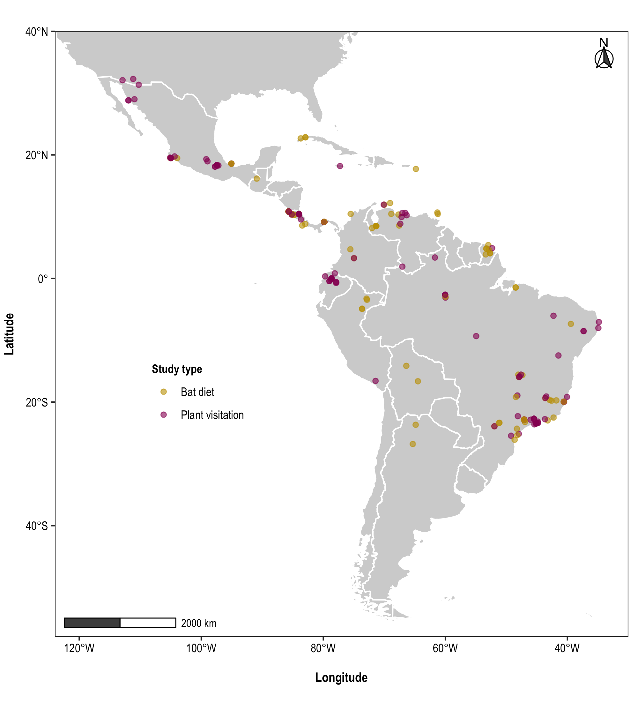
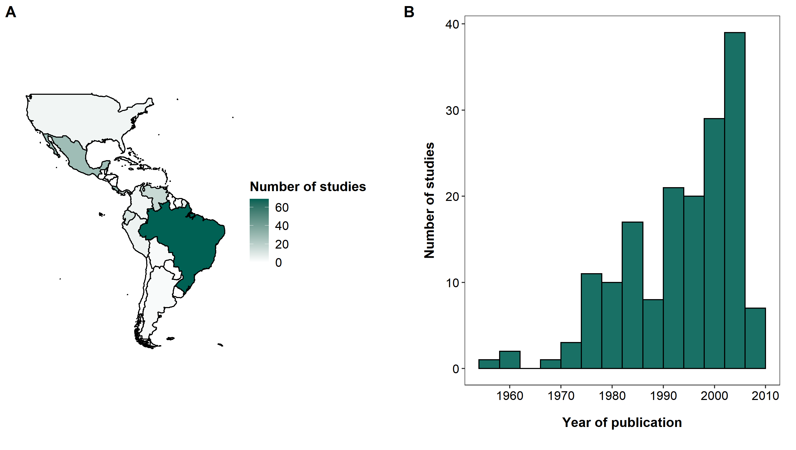
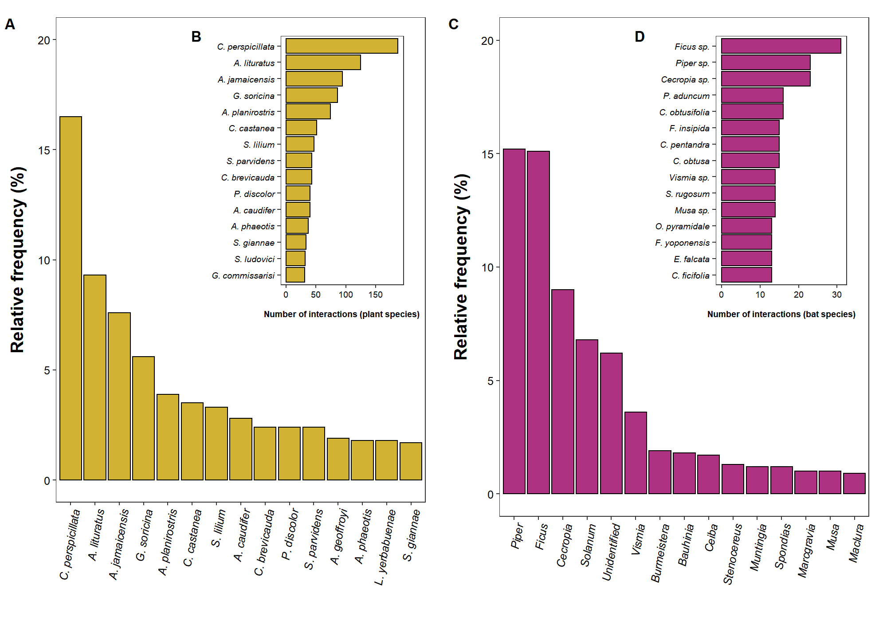
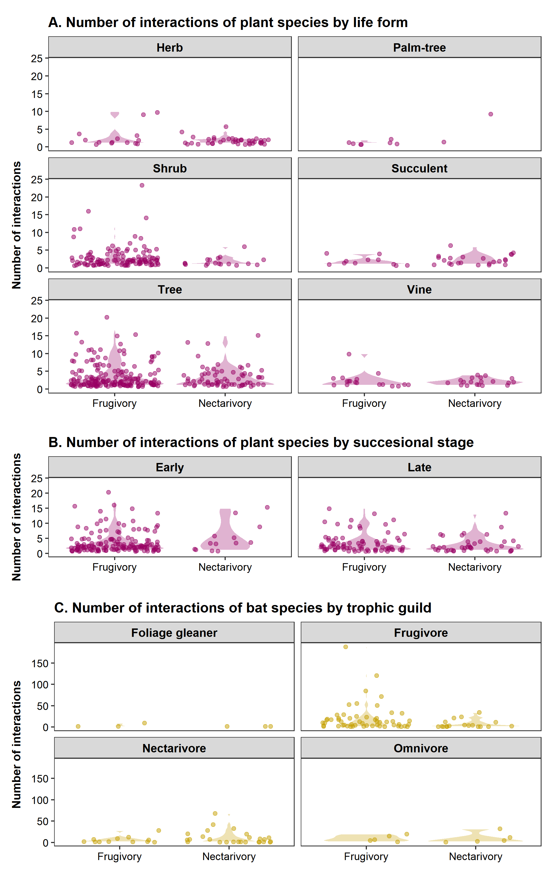
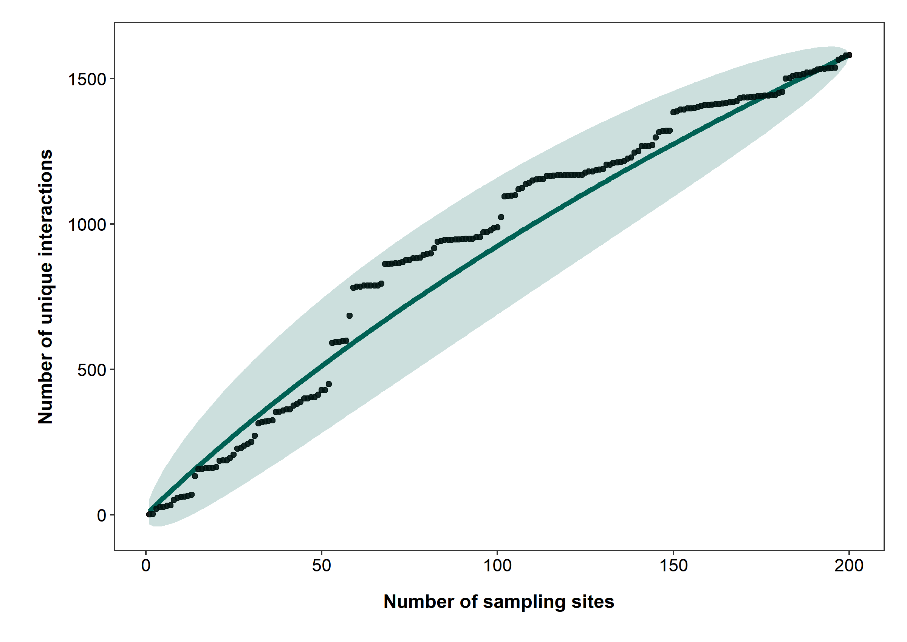

>> _1 Universidade Federal do ABC (UFABC). Centro de Ciências Humanas e Naturais. 09210-580 Santo André, SP, Brazil._
>>
>> _2 Institution. Departament. Postal Code. City, Country XXXXXXXXXXXXXXXXXXXXXX XXXXXXXXXXXXXXXXXXXXXXX XXXXXX_
>>
>> _3 Universidade Federal Rural do Rio de Janeiro (UFRRJ). Instituto de Biologia, Laboratório de Mastozoologia. 23890-000 Seropédica, RJ, Brazil._
>>
>> _4 Institution. Departament. Postal Code. City, Country _
>>
>> _5 Department of Biology and Burke Museum of Natural History and Culture, University of Washington, Seattle, WA, 98195, USA_
>>
>> _6 Institution. Departament. Postal Code. City, Country XXXXXXXXXXXXXXXXXXXXXX XXXXXXXXXXXXXXXXXXXXXXX XXXXXX_ 
>>
>> _7 Institution. Departament. Postal Code. City, Country_
>>
>> _8 Universidade de São Paulo. Departamento de Matemática Aplicada e Estatística, Instituto de Ciências Matemáticas e de Computação. 13560-970 São Carlos, SP, Brazil_
>>
>> _9 Universidade de São Paulo (USP), Instituto de Biociências, Departamento de Ecologia Geral. 05508-090 São Paulo, SP, Brazil._
&nbsp;

>> *Corresponding author: Guillermo L. Florez-Montero (gflorezmontero@gmail.com)

&nbsp;


```{r processing data, code=readLines("./Code/chunk_1.R"), message=FALSE, warning=FALSE, include=FALSE}
```

# INTRODUCTION

&nbsp;

Open access to primary scientific data is fundamental to assure the social contract that governs scientific publishing [@vision2010]. Making primary data available improves the transparency, reproducibility, and progress of science by allowing independent verification and reuse of published data. [@costello2009]. This access has been facilitated in the information age through important frameworks for the production, storage, curation, and sharing of  ecological data. These frameworks  aim to preserve data in the long term, even beyond the life of their initial compilers and curators [@chavan2009].

&nbsp;

One of those frameworks are data papers, which optimize efforts in the discovery, organization, and availability of ecological data [@chavan2011]. They offer a highly reliable source of data, as they have been subjected to high-quality control measures, such as peer review and editorial control of data and metadata [@costello2013]. This new kind of publication has revolutionized contemporary science by making decades of naturalistic information widely available in highly accessible and comprehensive formats.

&nbsp;

The revolution has also reached mammalogy. Data papers on mammal communities are growing in number. There are, for instance, data papers on the global non-volant mammal community [@thibault2011]. Another important source is the BioTIME database of biodiversity time series for the Anthropocene [@dornelas2018]. Others have larger scope, such as the global database for metacommunity ecology, integrating species, traits, environment, and space [@jeliazkov2020]. 

&nbsp;

In Brazil, the most famous mammalogical data papers were produced by the ATLANTIC Series, which contains information about the biodiversity of the Atlantic Forest of South America. This series includes data papers on plant-frugivore interactions [@bello2017], rodents and marsupials: [@bovendorp2017], bats [@muylaert2017], primates [@culot2019], and medium-and large-sized mammals [@souza2019]. Many other data papers were produced by other research groups outside the ATLANTIC Series, focusing on groups such as small mammals [@figueredo2017]. Nevertheless, only a few of them covered larger spatial scales, such as Neotropical xenarthrans [@santos2019]. In addition, most of them are based on abundance-incidence species data whereas species interactions received much less attention.

&nbsp;

Mutualistic interactions between animals and plants are a cornerstone of terrestrial ecosystems. Almost 94% of plants in neotropical communities are pollinated by animals [@ollerton2011], while 70–94% have their seeds dispersed by vertebrates [@jordano2013]. Bats are especially important in this context, as they represent the second largest group of seed dispersers in the Neotropics, after birds [@bello2017]. On the other hand, even though insects pollinate most flowering plants, bats are also the second group of pollinating vertebrates since they pollinate about 2% of the extant plant genera [@skercioglu2006]. Bat-plant interactions also generate ecosystem services, such as the pollination of economically important plants and the dispersal of seeds from pioneer plants that are key to habitat regeneration [@kunz2011].

&nbsp;

In the present data paper, we compiled a georeferenced database of `r nrow(records)` interaction records of frugivory and nectarivory between `r n_bats` bat species and `r n_plants` plant species. The data came from `r nrow(references)` studies covering `r nrow(sites)` locations in `r nrow(countries)` countries all over the Neotropical region. (Figure 1). The database compiled by @geiselman2002 was used as a starting point and was filtered and updated. NeoBat Interactions is so far the most extensive bat-plant interaction database both in geographic and taxonomic terms. Most sampling sites are georeferenced with high coordinate accuracy. All records came from primary sources and were taxonomically verified and updated. Besides, our database includes some geographic and abiotic information of study sites such as vegetation type, rainfall and precipitation, and ecological information of species, such as a life form and successional stage of plants, and trophic guild of bats. The data are organized and standardized at different levels of ecological complexity and temporal and geographic scales, which allows using them in a variety of studies with different scopes.


```{r Fig 1, echo=FALSE, out.width="90%", fig.align ="center", fig.pos = "!t", fig.cap="Distribution of sampling sites included in NeoBat Interactions. Dots show the location of original studies focused on plant visitation (purple) and bat diet (yellow). White lines show country borders. We included only studies with records of bat-plant interactions that were confirmed either by indirect or direct observation."}



```


\clearpage

# METADATA
&nbsp;

## CLASS I. DATA SET DESCRIPTORS
&nbsp;

### A. Data set identity

>**Title:** NeoBat Interactions: a data set of bat-plant interactions in the Neotropics
&nbsp;

### B. Data set identification code

>**Suggested data set identity codes:**
>
>NeoBat_Interactions_References.csv
>
>NeoBat_Interactions_Sites.csv
>
>NeoBat_Interactions_Records.csv
&nbsp;

### C. Data set description

>**Principal Investigator(s):**
>
>1. Guillermo L. Florez-Montero.
>Universidade Federal do ABC. Centro de Ciências Humanas e Naturais. 09210-580 Santo André, SP, Brazil.
>
>
>2. Marco A. R. Mello.
>Universidade de São Paulo, Instituto de Biociências, Departamento de Ecologia Geral. 05508-090 São Paulo, SP, Brazil.
&nbsp;

>**Abstract:**
>
>Data papers and open databases revolutionized contemporary science, as they provide the long-needed incentive to collaborate in large international teams and make naturalistic information widely available. Nevertheless, most of them focus on occurrence or abundance, while species interactions received much less attention. To help fill this gap, we compiled a georeferenced data set of interactions between `r n_bats` bat species of the family Phyllostomidae (Chiroptera) and `r n_plants` plant species of  `r n_plantfam` families. Data came from `r nrow(references)` studies published from `r min(references$Year)` to `r max(references$Year)` in the entire Neotropical Region, with most records from `r countries[1,1]` (`r countries[1,3]`% of all study sites), `r countries[2,1]` (`r countries[2,3]`%), and `r countries[3,1]` (`r countries[3,3]`%). Our data set includes `r nrow(records)` records of frugivory (`r interaction_type[1,2]`% of all records) and nectarivory (`r interaction_type[2,2]`%). The best represented bat genera are _`r batrecords[1,1]`_ (`r batrecords[1,2]`% of all records), _`r batrecords[2,1]`_  (`r batrecords[2,2]`%), _`r batrecords[3,1]`_  (`r batrecords[3,2]`%), and _`r batrecords[4,1]`_  (`r batrecords[4,2]`%). _`r batdegree[1,1]`_ (`r batdegree[1,2]`),  _`r batdegree[2,1]`_ (`r batdegree[2,2]`), _`r batdegree[3,1]`_ (`r batdegree[3,2]`), _`r batdegree[4,1]`_ (`r batdegree[4,2]`), and _`r batdegree[5,1]`_ (`r batdegree[5,2]`) are the bat species with the broadest diets recorded in number of plant species. Among plants, the best represented families are `r plantrecords[1,1]` (`r plantrecords[1,2]`%), `r plantrecords[2,1]` (`r plantrecords[2,2]`%), `r plantrecords[3,1]` (`r plantrecords[3,2]`%), and `r plantrecords[4,1]` (`r plantrecords[4,2]`%). Plants of the genera _`r plantdegree[1,1]`_ (`r plantdegree[1,2]`), _`r plantdegree[2,1]`_ (`r plantdegree[2,2]`), _`r plantdegree[3,1]`_ (`r plantdegree[3,2]`), _`r plantdegree[4,1]`_ (`r plantdegree[4,2]`), and _`r plantdegree[5,1]`_ (`r plantdegree[5,2]`) hold the largest number of interactions. These data are stored as arrays (records, sites, and studies) organized by logical keys and rich metadata, which helps compile the information at different ecological and geographic scales, according to how they should be used. Our data set on bat-plant interactions is so far the most extensive both in geographic and taxonomic terms, and also includes some abiotic information of study sites and ecological information of plants and bats. It has already helped us develop several studies and we hope it will stimulate novel analyses and syntheses, in addition to pointing out to important gaps in knowledge.
&nbsp;

### D. Key words  
&nbsp;
Species interactions, mutualism, nectarivory, frugivory, pollination, seed dispersal, databases, networks.

&nbsp;

### E. Description  

&nbsp;

This database includes `r nrow(records)` records of interactions involving the consumption of nectar and fruits by bats, taken from studies carried out focused on bat diets or plant visitation by bats across the Neotropics (Figure 1). The information came from `r nrow(countries)` countries, from southwestern United States of America to northwestern Argentina. We have compiled `r nrow(references)` scientific papers carried out over `r max(references$Year) - min(references$Year)` years, in `r nrow(sites)` study locations. The spatial and temporal distribution of the studies is not heterogeneous.`r countries[1,1]` (`r countries[1,2]`), `r countries[2,1]` (`r countries[2,2]`), `r countries[3,1]` (`r countries[3,2]`) and `r countries[4,1]` (`r countries[4,2]`) are the countries where most studies have been carried out (Figure 2A). Likewise, the number of  studies on frugivory and nectarivory was low between the 1950s and the 1970s, peaking between the 1980s and the 2000s (Figure 2B).


```{r Figure 2, echo=FALSE, fig.align ="center", out.width="100%", fig.pos= "!ht", fig.cap="Distribution of the number of studies on frugivory and nectarivory by bats, published by country (A) and throughout the recorded period (B)."}



```

&nbsp;

The best represented interaction type was frugivory (`r interaction_type[1,2]`% of all records) while nectarivory represents (`r interaction_type[2,2]`%) of the records. Although most data come from fruit- and nectar-feeding bats, there are also interaction records of species from other trophic guilds that occasionally feed on fruit or nectar. Likewise, this database includes information mainly on trees and shrubs, although it also contains other plant life forms such as vines and herbs. Several species have no information on successional stage, but there are many classified as early successional species (Table 1). We have included information about  interaction strength, nevertheless `r n_weight`% of the records have no such data, mainly because strengths were not reported in the source papers. Regarding their conservation status, `r sum(batsiucn$Frequency_R[1:3])`% of the bat species and `r sum(plantsiucn$Frequency_R[1:4])`% of the plant species are listed in some category of threat according to the IUCN (Table 2). However, most  plant species (`r plantsiucn$Frequency_R[plantsiucn$Category == "Not Evaluated (NE)"]`%) and some bat species (`r batsiucn$Frequency_R[batsiucn$Category == "Not Evaluated (NE)"]`%) have not been listed in any category. 

```{r table 1 and 2, echo=FALSE,  message=FALSE, warning=FALSE}
# add the table 1
all %>% 
  kableExtra::kbl(booktabs = T, align = "l", caption = "Ecological information of bat and plant species recorded in the NeoBat Interactions database") %>%
  kableExtra::kable_styling(full_width = F, latex_options = "hold_position") %>%
  kableExtra::row_spec(0, bold=T) %>%
  kableExtra::collapse_rows(columns = 1, latex_hline = "major", valign = "middle")

# add the table 2
alliucn %>% 
  kableExtra::kbl(booktabs = T, align = "l", caption = "IUCN conservation status of animals and plants species reported in the NeoBat Interactions database") %>%
  kableExtra::kable_styling(full_width = F, latex_options = "hold_position") %>%
  kableExtra::row_spec(0, bold=T) %>%
  kableExtra::collapse_rows(columns = 1, latex_hline = "major", valign = "middle")
```

&nbsp;

The taxonomic scope of this data paper encompasses `r n_bats` species and `r n_batg` genera of bats of the family Phyllostomidae, and `r n_plants` species, `r n_plantg` genera and `r n_plantfam` families of plants. The most frequent bat recorded was *`r batrecordsSP[1,1]`*, followed by *`r batrecordsSP[2,1]`* 
which have also been reported as hyper-dominant species in other community-focused databases [@muylaert2017] as they are cosmopolitan species, widely distributed across the neotropical region [@gardner2008]. Only seven species are responsible for almost `r round(sum(batrecordsSP[1:7,2]))`% of records: *`r batrecordsSP[1,1]`* (`r batrecordsSP[1,2]`%), *`r batrecordsSP[2,1]`* (`r batrecordsSP[2,2]`%), *`r batrecordsSP[3,1]`* (`r batrecordsSP[3,2]`%), *`r batrecordsSP[4,1]`* (`r batrecordsSP[4,2]`%), *`r batrecordsSP[5,1]`* (`r batrecordsSP[5,2]`%), *`r batrecordsSP[6,1]`* (`r batrecordsSP[6,2]`%) and *`r batrecordsSP[6,1]`* (`r batrecordsSP[6,2]`%). In contrast, most of bats species are infrequent, `r sum(batrecordsSP[,2]<=1)` species have a relative frequency $\leq 1$% (Figure 3A). *`r batrecordsSP[78,1]`*, *`r batrecordsSP[79,1]`*,   *`r batrecordsSP[80,1]`*,  *`r batrecordsSP[81,1]`*,  *`r batrecordsSP[82,1]`*,  *`r batrecordsSP[83,1]`*,  *`r batrecordsSP[84,1]`*,  *`r batrecordsSP[85,1]`*,  *`r batrecordsSP[86,1]`*,  *`r batrecordsSP[87,1]`*,  *`r batrecordsSP[88,1]`*,  *`r batrecordsSP[89,1]`*,  *`r batrecordsSP[90,1]`*,  *`r batrecordsSP[91,1]`*,  *`r batrecordsSP[92,1]`* and  *`r batrecordsSP[93,1]`* were the rarest species, representing `r round(sum(batrecordsSP[78:93,2]),2)`% of all records.

&nbsp;


Plants of the genera *`r plantrecordsGN[1,1]`* (`r plantrecordsGN[1,2]`% of the records), *`r plantrecordsGN[2,1]`* (`r plantrecordsGN[2,2]`%), *`r plantrecordsGN[3,1]`* (`r plantrecordsGN[3,2]`%) and *`r plantrecordsGN[4,1]`* (`r plantrecordsGN[4,2]`%) were the most abundant in this database, as they represent the main food source for bats of the genera *Carollia*, *Artibeus* and *Sturnira*, which also were relatively abundant groups recorded [@fleming1982foraging]. Several species are recorded as unidentified (`r plantrecordsGN$Frequency[plantrecordsGN$PlantGenus == "Unidentified"]`%) which reflects the difficulty of identifying plants from seed samples, which was the principal sampling method used in the studies (Figure 3C). Plants of the genera *`r df <- as.data.frame(plantrecordsGN); paste(df$PlantGenus[135:189], sep = ", ")`* and *`r df$PlantGenus[190]`* were the less represented in this database, accumulating the `r sum(df$Frequency[135:190])`% of all records. 

&nbsp;

*`r batdegree[1,1]`* (`r batdegree[1,2]` species of plants), *`r batdegree[2,1]`* (`r batdegree[2,2]`), *`r batdegree[3,1]`* (`r batdegree[3,2]`) and *`r batdegree[4,1]`* (`r batdegree[4,2]`) were the species with highest number of interactions as they also were very abundant species (Figure 3B). Most of species of bats `r sum(batdegree$Degree >=5)` interact with at least five species of plants. The species with only one interaction recorded in this database were: *`r df2 <- as.data.frame(batdegree); paste(df2$CurrentBatSpecies[c(73,75:91)], sep = ", ")`* and *`r df2$CurrentBatSpecies[92]`*. 

&nbsp;

On the contrary, most of plants recorded (`r sum(plantdegreeSP$Degree <=5)` species) interact with less than five bat species. *`r plantdegreeSP[1,1]`* (`r plantdegreeSP[1,2]` species), *`r plantdegreeSP[2,1]`* (`r plantdegreeSP[2,2]`) and *`r plantdegreeSP[3,1]`* (`r plantdegreeSP[3,2]`) hold the highest number of interactions. The rest of plant species (`r sum(between(plantdegreeSP$Degree, 6, 16))`) interact with between 6 and 16 bat species (Figure 3D).


```{r fig 3, echo=FALSE, fig.align ="center", out.width="100%", fig.pos= "!ht", fig.cap="Ranking of frequency of the 15 most abundant bat species (A) and plant genera (C). Internal plots represent the number  of each one of the 15 species of bats (B) and plants (D) with most interactions recorded in the NeoBat Interaction database"}



```

&nbsp;

Each species of plant interact with a relatively low number of bat species and the range of the number of interactions varies considerably ($\bar{x} = `r round(mean(intlifeform$Mean))`$, range = 1 - `r max(intlifeform$Max)`). Most of species of trees hold the a large number of interactions of frugivory (`r intlifeform[9,3]` species, range = `r intlifeform[9,5]` - `r intlifeform[9,6]` interactions) and the largest number of nectarivory (`r intlifeform[10,3]` species, range = `r intlifeform[10,5]` - `r intlifeform[10,6]` interactions). A large number of shrubs (`r intlifeform[5,3]` species) holds interactions of frugivory (range = `r intlifeform[5,5]` - `r intlifeform[5,6]` interactions), and a very small number of species (`r intlifeform[6,3]`) of nectarivory (range = `r intlifeform[6,5]` - `r intlifeform[6,6]` interactions). Despite trees and shrubs are the life form of plants with most number of records, this database also includes information of nectarivory and frugivory of vines, succulents (Cactaceae) and palm-trees (Figure 4A).

&nbsp;

Most of frugivory interactions come from Early Succesional plants (`r intsstage[1,3]` species), holding interactions with between `r intsstage[1,5]` and `r intsstage[1,6]` bat species while Late Successional plants (`r intsstage[3,3]` species) interact with between `r intsstage[3,5]` and `r intsstage[3,6]` bat species. Otherwise, nectarivory interactions came from Late Succesional plants (`r intsstage[4,3]` species) against Early (`r intsstage[2,3]` species). Both groups interacting with  between `r intsstage[2,5]` and `r intsstage[2,6]` bat species (Figure 4B). Most of the records in NeoBat Interactions come from fruit eating bats. Frugivorous can eat fruits of a large number of plant species (range = `r intbatguild[3,5]` - `r intbatguild[3,6]` interactions). Some species (`r intbatguild[4,3]`) also can eat nectar of a considabel wide number of plants (range = `r intbatguild[4,5]` - `r intbatguild[4,6]` interactions). Nectarivorous bats eat nectar from `r intbatguild[6,5]` - `r intbatguild[6,6]` species and fruits from `r intbatguild[5,5]` - `r intbatguild[6,5]` species of plants. Species of Omnivorous bats interacts with fruits and nectar of up to 32 species of plats. Finally, this database also contains information of Foliage gleaner bats of the genus *Lampronycteris, Glyphonycteris, Trinycteris,* and *Micronycteris* eating fruits and nectar ot up to nine species of plants (Figure 4C).

```{r fig 4, echo=FALSE, fig.align ="center", out.width="80%", fig.pos= "!h", fig.cap = "Number of interactions holds by plant and bat species according to their ecological traits: A) Life form of plants, B) Successional stage of plants and C) Trophic guild of bats. Each violet point on A and B represents one plant species, each yellow point on C represents one bat species."}



```

\clearpage
## CLASS II. RESEARCH ORIGIN DESCRIPTORS
&nbsp;

### A. Overall project description

>**Identity:** A compilation of bat-plant interactions in the neotropical region.
&nbsp;

>**Period of study:** Dates of source publications range from `r min(references$Year)` to `r max(references$Year)`.
&nbsp;

>**Objectives:** We aimed 1) to sumarize and make available the information about frugivory and nectarivory interactions between bat and plants in the Neotropics as well as some ecological information for the utilization in studies of community ecology, ecological networks and macroecology; and 2) to identify the gaps of information on bat-plant interactions to direct future reseach and sampling effort. This dataset represents the most extensive and complete cataloge of bat-plant interactions in the neotropical region.
&nbsp;

>**Abstract:** Same as above.
&nbsp;

>**Source of funding:** This study was financed by the Brazilian Coordination for the Improvement of Higher Education Personnel (CAPES, student scholarships), the São Paulo Research Foundation (FAPESP, grant 2018/20695-7), Brazilian Council for Scientific and Technological Development (CNPq, grants 302700/2016-1, 304498/2019-0, and PEC-PG doctoral scholarship 190585/2017-0), Alexander von Humboldt Foundation (AvH, grants 1134644, 3.4-8151/15037, and 3.2-BRA/1134644) and Dean of Research of the University of São Paulo (PRP-USP, grant 18.1.660.41.7).
&nbsp;

### B. Specific subproject description

>**Site description:** The neotropical region is one of the eight biogeographic realms of the world and extends from southestern United States to Patagonia, including the Caribbean and some pacific islands [@olson2001]. The region is comprised by 17 Phytogeographic Domains divided in 96 eco-regions including the Nearctic Mexico Domain [@oliveirafilho2017]. The vegetation of the region is very diverse, includes xeric and thorny shrubs, open fields, sandy and rocky vegetation, woodlands, savanas, deciduous and semideciduous forest, rainforest, cloud forest, dwarf forest, floodplains, amoung others.

> The Neotropics is the most species-rich realms in the world and has hight leveles of endemism [@ulloa2017]. Due the hight level of endemism and the level of threatheness in some areas, seven of the 25 hotspots of biodiversity are in the neotropical region: Mesoamerica, Caribean Islands, Tumbes-Choco-Magdalena, Tropical Andes, Cerrado, Atlantic Forest, and Chilean Winter Rainfall and Valdivian Forests [@Mittermeier2011], beside the Amazonia rainforest, the most biodiverse eco-region in the world [@hoorn2010amazonia]. 
&nbsp;

>**Data compilation:** The present database was originally compiled from the Bat-Plant Interaction Database, currently known as Bat Eco-Interactions [@geiselman2002]. We have also carried out a bibliographic search of different sources: 1) online databases as Web of Web of Knowledge, Scopus, Scielo and Google Scholar, 2) references cited in the literature and 3) direct comunication with local experts and collegues. The bibliographic search was performed using the key-words: bat-plant interactions, bat(s) diet + frugivory, bat(s) diet + nectarivory, plant visitation + bat(s), bat(s) pollination, bat(s) seed dispersal. The serch were conducted in  English, Spanish, Portuguese and French. We compiled information from 169 references, mainly papers but also tecnical reports, chapters and unpublished data. For each sampling site we collected information about vegetation type, mean temperature, rainfall, altitude, potential evapo-transpiration and aridity index (see Table 4).
&nbsp;

>**Research Methods:** We include studies that reported interactions of frugivory or nectarivory in the field, through the analysis of the diet of bats, the observation of the plant visitation or diet experiments. We exclude those records from second-hand references or not confirmed potential interactions.  When available, the interaction strength was reported as the number of fecal samples containing the plant
seed for frugivory, and the number of visits of each bat species to each plant per sampling unit for nectarivory. Lack of information were filled with NA. We also included information from the geographical location (latitude, longitude, locality, state and country). Geographic information was conferred one by one using Google maps.

> We compiled information of bat-plant interactions from @greenhall1957, @alcorn1961, @de1961habitos, @jimbo1967feeding, @wilson1971food, @heithaus1974bat, @howell1973food, @heithaus1975foraging, @sazima1975quiropterofilia, @janzen1976two, @sazima1976observations, @fleming1977experimental, @nellis1977observations, @sazima1977solitary, @heithaus1978foraging, @morrison1978foraging, @morrison1978influence, @sazima1978bat, @bonaccorso1979foraging, @morrison1980efficiency, @sazima1980bat, @voss1980floral, @august1981fig, @fleming1981fecundity, @mccracken1981social, @uhl1981early, @heithaus1982cumulative, @sazima1982pollination, @roberto1983chauves, @steiner1983pollination, @foresta1984zoochorie, @estrada1984comparison, @estrada1984observations, @helversen1984nectar, @hopkins1984floral, @lemke1984foraging, @ramirez1984floral, @fleming1985coexistence, @fleming1985phenology, @uieda1984dispersao, @Charles-Dominique1986, @coates1986fruiting, @dinerstein1986, @fleming1986seasonal, @herbst1986role, @bonaccorso1987feeding, @Eguiarte1987, @sazima1987additional, @palmeirim1989trophic, @sazima1989bat, @fleming1990phenology, @hokche1990pollination, @charles1991feeding, @handley1991diet, @handley1991food, @marinho1991coexistence, @soriano1991habitos, @ascorra1992bat, @buzato1992tetrastylis, @fischer1992foraging, @hernandez1992intestinal, @muller1992particcao, @ascorra1993bats, @gribel1993pollination, @kress1993morphology, @sosa1993solapamiento, @willig1993dietary, @buzato1994pollination, @galetti1994diet, @marinho1994dispersao, @sazima1994fruit, @sazima1994nectar, @zortea1994observations, @cunningham1995ecological, @engriser1995effect, @gorchov1995dietary, @silva1995observation, @figueredo1996vertebrates, @sahley1996bat, @sosa1996resource, @valiente1996ecological, @bizerril1997feeding, @hernandez1997selective, @iudica1997feeding, @locatelli1997floral, @nassar1997comparative, @pedro1997taxonomic, @petit1997diet, @ruiz1997relaciones, @valiente1997pollination, @lppolito1998flowering, @kalko1998echolocation, @machado1998bat, @casas1999reproductive, @gastal1999ground, @giannini1999selection, @gibbs1999postzygotic, @gribel1999flowering, @Sazimaetal1999, @tschapka1999pollinators, @tschapka1999bat, @arizaga2000pollination, @garcia2000seed, @godinez2000fruit, @ruiz2000estudio, @slauson2000pollination, @soriano2000notas, @wendeln2000nutritional, @Charles-Dominique2001, @herrera2001sources, @herrera2001role, @kay2001observations, @varassin2001role, @banack2002disperser, @coelho2002diet, @godinez2002role, von2002glossophagine, @martino2002feeding, @mikich2002dieta, @muchhala2002flower, @stoner2002effects, @aguirre2003implications, @caceres2003fruit, @lobo2003factors, @lobova2003cecropia, @mikich2003attraction, @molina2003pollination, @naranjo2003effect, @nogueira2003fig, @passos2003artibeus, @passos2003frugivoria, @sazima2003dyssochroma, @giannini2004trophic, @lima2004availability, @lobova2004epizoochorous, @lopez2004observations, @machado2004north, @mello2004seasonal, @passos2004observaccoes, @quesada2004effects, @thies2004phenology, @tschapka2004energy, @valiente2004geographic, @vogel2004harpochilus, @aguiar2005first, @delaval2005interspecific, @ibarra2005pollination, @korine2005fruit, @lobo2005effects, @mancina2005pollen, @mello2005size, @sanmartin2005chiropterophily, @tschapka2005reproduction, @vogel2005bat, @acosta2006nuevo, @arias2006effectiveness, @mancina2002plantas, @muchhala2006pollination, @muchhala2006nectar, @tschapka2006bat, @aguiar2007bat, @estrada2007nuevo, @lopez2007food, @mancina2007habitat, @olea2007diversidad, @fatima2007determinacion, and @tavares2007bat. 

>The interaction records of @giannini2004trophic do not appear in the original article as the information colected in that study were identified, cured and added by Marco Mello latelly. The rest of the information can be verified in the original articles.
&nbsp;

>**Taxonomic information:** For bat species, we followed de taxonomic arrangement in @simons2020. We added a column with the current bat name following verification of the taxonomy and geographic distribution made by the specialist Marcelo Nogueira. Txonomic changes in the current name of species and geographic distribution was conferred in @cole2006leptonycteris, @solari2006mitochondrial, @mantilla2009phyllostomid, @velazco2010systematics, @mantilla2014defining, @nogueira2014checklist, @tavares2014systematics, @velazco2014two, @velazco2019small, @basantes2020systematics, @catzeflis2020liste, @lim2020cryptic, @ramirez2020endemic, @siles2020revision, @tiria2020ecuador, @turcios2020systematic, @vargas2020systematic, and @velasco2020. For plants taxonomy, we update the nomenclature and correct the synonyms following The Plant List (2013) and @flora2020.
&nbsp;

>**Functional traits information:** We reported the Life form and the Successional stage of plant specie. We compiled this information from the literature [@dinerstein1986; @galindo2000bat; @garcia2000seed; @kammesheidt2000some; @lopez2004observations; @mantovanidiversidade; @oatham2006dynamics; @olea2007diversidad; @marimon2008desenvolvimento; @fleming2009evolution; @gusson2009caracteristicas; @garcia2011composiccao; @ramos2011estudo; @swanson2011forgotten; @sampaio2012estudo; @conde2013fitossociologia; @paolucci2019lowland; @aximoff2020acnistus], and also from the species information of the @flora2020, and the virtual herbarium of the *Smithsonian Museum of Natural History* (https://collections.nmnh.si.edu/search/botany/) and the *Royal Botanic Garden Edinburgh* (https://data.rbge.org.uk/). The trophic guild classification of bat species was made following @gardner1977feeding, @willig1986bat and @soriano2000functional.

&nbsp;

### C. Data limitations and potential enhancements

&nbsp;

Documenting bat-plant interactions in a continental scale is a big challenge. We accept that NeoBat interactions database has several biases. The first is temporary, although this database includes 70 years of publications on bat-plant interactions, it also has a delay of 13 years, which will be corrected in future updates. The second one is the representativeness, our database is clearly biased towards frugivory studies of common and abundant bat species in Neotropical environments. Thus, our database represents only a small subset of all bat-plant interactions in the region. The rarefaction curve shows that despite having registered 1,581 interactions in 200 sampling sites, the trend is far from reaching an asymptote (Figure 5).

&nbsp;

The lack of standardization in the frugivory and nectarivory sampling methods makes it difficult to acquire data that confirm interactions in the field. Sampling methods vary significantly between studies focused on plants or bats. Studies focused on plants are sampled primarily through the observation of a single species and its floral visitors or fruit removers. On the other hand, studies focused on bats are made mainly by the analysis of fecal samples from one species or the entire assemblage. In these studies, the capture is mainly carried out with mist nets, which adds a bias towards animals that fly in the understory [@tschapka1998compact].  Some studies use seed traps to collect the seeds rain under the canopy [@medellin1999seed; @arteaga2006seed]. However, these methods do not allow to identify which bat species each fecal sample belongs to and therefore are not very useful for recording pairwise interactions.

```{r Fig 5, echo=FALSE, out.width="90%", fig.align="center", fig.pos="!h", fig.cap="Interactions accumulation curve by sampling site. Black dots represent the empirical accumulation data, green line represents the rarefaction curve based on Chao2 non-parametric estimator and green polygon is the 95\\% confidence interval of the rarefaction curve."}



```

&nbsp;

We also have identified some of the shortfalls in large-scale knowledge about bat-plant interactions in the region [@hortal2015seven]: 

&nbsp;

**Linnean Shortfall:** Identifying species is a great challenge for studies on ecological interactions. This database presents some gaps in different taxonomic levels mainly in the identification of plants. `r unidsp` records of `r nrow(records)` are identified only at the genus level, `r unidgen` are registered as "Unidentified" genus of which only `r unidfam` are not even identified at th family level. Nevertheless, bat taxonomy is at least more clear as only 57 records of *Platyrrhinus* from the Amazonia and Venezuela, and small size *Artibeus* are not identified at species. Most of the studies on frugivory and some on nectarivory come from the analysis of bats diet. It represents a great issue since identifying plant species from seeds and pollen is remarkably difficult. Carrying out diet studies involves a much greater effort than collecting and identifying samples from bats, and to improve the precision in plant identification, it is necessary to make reference collections of seeds and pollen over long periods. Some studies have chosen to use more advanced techniques such as DNA barcoding to identify the diet content [@gonzalezvaro2014; @lim2018impact]. These techniques can improve the taxonomic resolution of the data but involve an increase in operating costs that makes them difficult to use in many neotropical countries. On the other hand, studies on floral visit and fruit removal carried out from observation or photographic record can also lead to misidentification of bat species. In this sense, combining the photographic record with captures in mistnets can help researcher to solve these types of issues.

&nbsp;

**Wallacean Shortfall:** The lack of information about geographic distribution of species is a worldwide issue [@lomolino2004]. Despite the increasing effort to sample animals and plants separately, it is not adequate to fill out this shortfall when referred to ecological interactions. Infer ecological interactions only by co-occurrence data is not correct since that interactions can be conditioned by another kind of biotic and abiotic processes, more than the simple presence of the two species at a local scale [@Blanchet2020co]. In this database we have only compiled verified interactions however it is clear the existence of a large gap in sampling and publishing information on bat-plant interactions in the region (Figure 2A), which makes it even harder to understand the geographic distribution of such interactions.

&nbsp;

**Prestonian Shortfall:** This shortfall concerns to the gap in knowledge about the abundance of species [@cardoso2011seven]. 

&nbsp;

## CLASS III. DATA SET STATUS AND ACCESSIBILITY

&nbsp;

### A. Status

```{r chunk tables, code=readLines("./Code/chunk_2_tables.R"), message=FALSE, warning=FALSE, include=FALSE}
```

\clearpage
\renewcommand{\arraystretch}{1.8}
```{r table 3-5, echo=FALSE,  message=FALSE, warning=FALSE}


table_3 %>%
  kableExtra::kbl(align = "l", booktabs = F, format = "latex",
                  caption = "Information about the references in the NeoBat Interactions database") %>%
  kableExtra::kable_styling(full_width = F, position = "center",
                          latex_options = c("hold_position")) %>%
  kableExtra::column_spec(1, width = "3cm") %>%
  kableExtra::column_spec(2, width = "5cm") %>%
  kableExtra::column_spec(3, width = "3.6cm") %>%
  kableExtra::column_spec(4, width = "3.4cm") %>%
  kableExtra::row_spec(0, bold = T)

table_4 %>% 
  dplyr::mutate_all(linebreak) %>%
  kableExtra::kbl(align = "l", booktabs = F, longtable = T, escape = F, format = "latex",
                  caption = "Information about the samplig sites in the NeoBat Interactions database") %>%
  kableExtra::kable_styling(full_width = F, position = "center",
                            latex_options = c("repeat_header")) %>%
  kableExtra::column_spec(1, width = "3cm") %>%
  kableExtra::column_spec(2, width = "5cm") %>%
  kableExtra::column_spec(3, width = "3.6cm") %>%
  kableExtra::column_spec(4, width = "3.4cm") %>%
  kableExtra::row_spec(0, bold = T)

table_5 %>% 
  dplyr::mutate_all(linebreak) %>%
  kableExtra::kbl(align = "l", booktabs = F, longtable = T, escape = F, format = "latex",
                  caption = "Information about the interaction records in the NeoBat Interactions database") %>%
  kableExtra::kable_styling(full_width = F, position = "center",
                            latex_options = c("repeat_header")) %>%
  kableExtra::column_spec(1, width = "3cm") %>%
  kableExtra::column_spec(2, width = "5cm") %>%
  kableExtra::column_spec(3, width = "3.6cm") %>%
  kableExtra::column_spec(4, width = "3.4cm") %>%
  kableExtra::row_spec(0, bold = T)
```
\clearpage


\clearpage
\bibliography{bibliography.bib}  
\clearpage

# REFERENCES

---
nocite: | 
 @trabucco2009global, @fick2017worldclim, @plantlist2013
...
