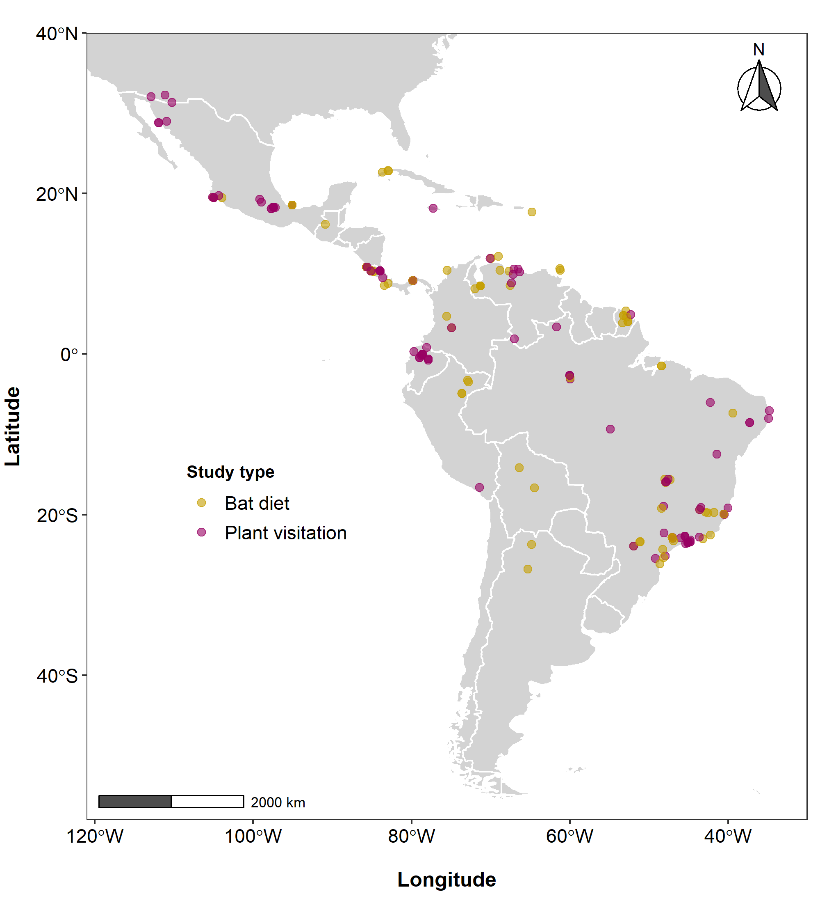

>> _1 Universidade Federal do ABC (UFABC). Centro de Ciências Humanas e Naturais. 09210-580 Santo André, SP, Brazil._
>>
>> _2 Institution. Departament. Postal Code. City, Country XXXXXXXXXXXXXXXXXXXXXX XXXXXXXXXXXXXXXXXXXXXXX XXXXXX_
>>
>> _3 Universidade Federal Rural do Rio de Janeiro (UFRRJ). Instituto de Biologia, Laboratório de Mastozoologia. 23890-000 Seropédica, RJ, Brazil._
>>
>> _4 Institution. Departament. Postal Code. City, Country _
>>
>> _5 Department of Biology and Burke Museum of Natural History and Culture, University of Washington, Seattle, WA, 98195, USA_
>>
>> _6 Institution. Departament. Postal Code. City, Country XXXXXXXXXXXXXXXXXXXXXX XXXXXXXXXXXXXXXXXXXXXXX XXXXXX_ 
>>
>> _7 Institution. Departament. Postal Code. City, Country_
>>
>> _8 Universidade de São Paulo. Departamento de Matemática Aplicada e Estatística, Instituto de Ciências Matemáticas e de Computação. 13560-970 São Carlos, SP, Brazil_
>>
>> _9 Universidade de São Paulo (USP), Instituto de Biociências, Departamento de Ecologia Geral. 05508-090 São Paulo, SP, Brazil._
&nbsp;

>> *Corresponding author: Guillermo L. Florez-Montero (gflorezmontero@gmail.com)

&nbsp;


```{r processing data, code=readLines("./Code/chunk_1.R"), message=FALSE, warning=FALSE, include=FALSE}
```


# INTRODUCTION

&nbsp;

Open access to primary scientific data is fundamental to assure the social contract that governs scientific publishing [@vision2010]. Making primary data available improves the transparency, reproducibility, and progress of science by allowing independent verification and reuse of published data. [@costello2009]. This access has been facilitated in the information age through important frameworks for the production, storage, curation, and sharing of  ecological data. Those frameworks which aim to preserve data in the long term, even beyond the life of the initial compilers and curators [@chavan2009].

&nbsp;

One of those frameworks are data papers, which optimize efforts in the discovery, organization, and availability of ecological data [@chavan2011]. They offer a highly reliable source of data, as they have been subjected to high-quality control measures, such as peer review and editorial control of data and metadata [@costello2013]. This new kind of publication has revolutionized contemporary science by making decades of naturalistic information widely available in highly accessible and comprehensive formats.
The revolution has also reached mammalogy. Data papers on mammal communities are growing in numbers. There are, for instance, data papers on the global non-volant mammal communities [@thibault2011]. Another important source is the BioTIME database of biodiversity time series for the Anthropocene [@dornelas2018]. Others have larger scope, such as the global database for metacommunity ecology, integrating species, traits, environment and space [@jeliazkov2020]. 

&nbsp;

In Brazil, the most famous mammalogical data papers were produced in the ATLANTIC Series, which contains information about the biodiversity of the Atlantic Forest of South America. This series includes data papers on plant-frugivore interactions [@bello2017], rodents and marsupials: [@bovendorp2017], bats [@muylaert2017], primates [@culot2019], and medium-and large-sized mammals [@souza2019]. Many other data papers were produced by other research groups outside the ATLANTIC Series, focusing on groups such as small mammals [@figueredo2017]. In addition, only a few covered larger spatial scales, such as Neotropical xenarthrans [@santos2019]. Nevertheless, most of them are based on abundance-incidence species data whereas species interactions received much less attention.

&nbsp;

Mutualistic interactions between animals and plants are a cornerstone of terrestrial ecosystems. Almost 94% of plants in neotropical communities are pollinated by animals [@ollerton2011], while 70 – 94% have their seeds dispersed by vertebrates [@jordano2013]. Bats are especially important in this context, as they represent the second largest group of seed dispersers in the Neotropics, after birds [@bello2017]. On the other hand, even though insects pollinate most of the flowering plants, bats are also the second group of pollinating vertebrates since they pollinate about 2% of plant genera [@skercioglu2006]. Bat-plant interactions also result in ecosystem services, such as the pollination of some economically important plants and the dispersal of seeds from pioneer plants that are key to habitat regeneration [@kunz2011].

&nbsp;

In the present data paper,we compiled a georeferenced database of `r nrow(records)` interaction records of frugivory and nectarivory between `r n_bats` bat species and `r n_plants` plant species. The data came from `r nrow(references)` studies covering `r nrow(sites)` locations in `r nrow(countries)` countries all over the Neotropical region. (Figure 1). The database compiled by @geiselman2002 was used as a starting point and was filtered and updated. NeoBat Interactions is so far the most extensive bat-plant interaction database both in geographic and taxonomic terms. Most sampling sites are georeferenced with high coordinate accuracy. All records came from primary sources and were taxonomically verified and updated. Additionally, our database includes ecological information, such as a life form and successional stage of plants, and trophic guild of bats. The data are organized and standardized at different levels of ecological complexity and temporal and geographic scales, which allows using them in a variety of studies with different scopes.

```{r Figure 1, echo=FALSE, out.width="90%", fig.align ="center", fig.pos = "!t", fig.cap="Distribution of sampling sites covered in NeoBat Interactions. Purple dots show the location of original studies reporting bat-plant interactions. White lines show country borders. We included only studies with records of bat-plant interactions that were confirmed either by indirect or direct observation."}



```

&nbsp;

# METADATA
&nbsp;

## CLASS I. DATA SET DESCRIPTORS
&nbsp;

### A. Data set identity

>**Title:** NeoBat Interactions: a data set of bat-plant interactions in the Neotropics
&nbsp;

### B. Data set identification code

>**Suggested data set identity codes:**
>
>NeoBat_Interactions_References.csv
>
>NeoBat_Interactions_Sites.csv
>
>NeoBat_Interactions_Records.csv

&nbsp;

### C. Data set description


>**Principal Investigator(s):**
>
>1. Guillermo L. Florez-Montero.
>Universidade Federal do ABC. Centro de Ciências Humanas e Naturais. 09210-580 Santo André, SP, Brazil.
>
>
>2. Marco A. R. Mello.
>Universidade de São Paulo, Instituto de Biociências, Departamento de Ecologia Geral. 05508-090 São Paulo, SP, Brazil.


&nbsp;

>**Abstract:**
>
>Data papers and open databases revolutionized contemporary science, as they provide the long-needed incentive to collaborate in large international teams and make naturalistic information widely available. Nevertheless, most of them focus on occurrence or abundance, while species interactions received less attention. To help fill this gap, we compiled a georeferenced data set of interactions between `r n_bats` bat species of the family Phyllostomidae (Chiroptera) and `r n_plants` plant species of  `r n_plantfam` families. Data were obtained from `r nrow(references)` studies published from `r min(references$Year)` to `r max(references$Year)` in the entire Neotropical Region, with most records coming from `r countries[1,1]` (`r countries[1,3]`% of all study sites), `r countries[2,1]` (`r countries[2,3]`%), and `r countries[3,1]` (`r countries[3,3]`%). Our data set includes `r nrow(records)` records of frugivory (`r interaction_type[1,2]`% of all records) and nectarivory (`r interaction_type[2,2]`%). The best represented bat genera are _`r batrecords[1,1]`_ (`r batrecords[1,2]`% of all records), _`r batrecords[2,1]`_  (`r batrecords[2,2]`%), _`r batrecords[3,1]`_  (`r batrecords[3,2]`%), and _`r batrecords[4,1]`_  (`r batrecords[4,2]`%). _`r batdegree[1,1]`_ (`r batdegree[1,2]`),  _`r batdegree[2,1]`_ (`r batdegree[2,2]`), _`r batdegree[3,1]`_ (`r batdegree[3,2]`), _`r batdegree[4,1]`_ (`r batdegree[4,2]`), and _`r batdegree[5,1]`_ (`r batdegree[5,2]`) are the bat species with the broadest diets recorded in number of plant species. Among plants, the best represented families are `r plantrecords[1,1]` (`r plantrecords[1,2]`%), `r plantrecords[2,1]` (`r plantrecords[2,2]`%), `r plantrecords[3,1]` (`r plantrecords[3,2]`%), and `r plantrecords[4,1]` (`r plantrecords[4,2]`%). Plants of the genera _`r plantdegree[1,1]`_ (`r plantdegree[1,2]`), _`r plantdegree[2,1]`_ (`r plantdegree[2,2]`), _`r plantdegree[3,1]`_ (`r plantdegree[3,2]`), _`r plantdegree[4,1]`_ (`r plantdegree[4,2]`), and _`r plantdegree[5,1]`_ (`r plantdegree[5,2]`) hold the largest number of interactions. These data are stored as arrays (records, sites, and studies) organized by logical keys and rich metadata, which helps compile the information at different ecological and geographic scales, as required by different studies. Our data set on bat-plant interactions is so far the most extensive both in geographic and taxonomic terms, and also includes some ecological information of plants and bats. It has already helped us develop several studies and we hope it will stimulate novel analyses and syntheses, in addition to pointing out to important gaps in knowledge for future research.
&nbsp;

### D. Key words  
&nbsp;

Species interactions, mutualism, nectarivory, frugivory, pollination, seed dispersal, databases, networks.
&nbsp;

### E. Description  
&nbsp;

This data base includes `r nrow(records)` records of interactions involving the consumption of nectar and fruit by bats, taken from studies carried out from the approach of the diet of bats and plant visitation across the Neotropics (Figure 1). The information came from `r nrow(countries)` countries, from the southwestern United States to northwestern Argentina. We have collected `r nrow(references)` scientific papers carried out over `r max(references$Year) - min(references$Year)` years, in `r nrow(sites)` study locations. The spatial and temporal distribution of the studies is not at all homogeneous.`r countries[1,1]` (`r countries[1,2]`), `r countries[2,1]` (`r countries[2,2]`), `r countries[3,1]` (`r countries[3,2]`) and `r countries[4,1]` (`r countries[4,2]`) are the countries with the most studies during that period (Figure 2A). Likewise, the number of published studies on frugivory and nectarivory were very scarce from the 1950s to the 1970s, having a peak of scientific production from the 1980s to the 2000s (Figure 2B).

&nbsp;

We have recorded `r nrow(records)` interaction events of frugivory (`r interaction_type[1,2]`% of all records) and nectarivory (`r interaction_type[2,2]`%) between `r n_bats` bat species and `r n_plants` plant species. Although most of the information comes from fruit- and nectar-feeding bats, we have also collected data of species with other trophic guilds that occasionally eat fruit or nectar. Likewise, this database includes information mainly on trees and shrubs, although it also contains other forms of life such as vines, herbs, and others. Many of species have no information on successional stage but many of the data cames from Early Successional species (Table 1). We have included information about the interaction strength, nevertheless `r n_weight`% of the reccords have no data, mainly because it was not reported in the paper.

&nbsp;

```{r Figure 2, echo=FALSE, fig.align ="center", out.width="100%", fig.pos= "!h", fig.cap="Distribution of the number of studies on frugivory and nectarivory by bats, published by country (A) and throughout the recorded period (B)."}

knitr::include_graphics("Figures/Figure_2.png")

```
&nbsp;

&nbsp;

```{r table 1, echo=FALSE,  message=FALSE, warning=FALSE}
# add the table
all %>% 
  kableExtra::kbl(booktabs = T, align = "l", caption = "Ecological information of bat and plant species recorded in the NeoBat Interactions database") %>%
  kableExtra::kable_styling(full_width = F, latex_options = "hold_position") %>%
  kableExtra::row_spec(0, bold=T) %>%
  kableExtra::collapse_rows(columns = 1, latex_hline = "major", valign = "middle")
```

&nbsp;

```{r table 2, echo=FALSE,  message=FALSE, warning=FALSE}
# add the table
alliucn %>% 
  kableExtra::kbl(booktabs = T, align = "l", caption = "IUCN conservation status of animals and plants species reported in the NeoBat Interactions database") %>%
  kableExtra::kable_styling(full_width = F, latex_options = "hold_position") %>%
  kableExtra::row_spec(0, bold=T) %>%
  kableExtra::collapse_rows(columns = 1, latex_hline = "major", valign = "middle")
```


```{r fig 3, echo=FALSE, fig.align ="center", out.width="100%", fig.pos= "!t", fig.cap="Ranking of frequency of the 15 most abbundant bat species (A) and plant genera (C). Internal plots represent the number of interaction of the 15 most abbundant species of bats (B) and plants (D)."}

knitr::include_graphics("Figures/Figure_3.png")
```


```{r metadata tables, code=readLines("./Code/chunk_2_tables.R"), message=FALSE, warning=FALSE, include=FALSE}
```


\clearpage
\renewcommand{\arraystretch}{1.8}
```{r table 3-5, echo=FALSE,  message=FALSE, warning=FALSE}

table_3 %>%
  kableExtra::kbl(align = "l", booktabs = F, format = "latex",
                  caption = "Information about the references in the NeoBat Interactions database") %>%
  kableExtra::kable_styling(full_width = F, position = "center",
                          latex_options = c("hold_position")) %>%
  kableExtra::column_spec(1, width = "3cm") %>%
  kableExtra::column_spec(2, width = "5cm") %>%
  kableExtra::column_spec(3, width = "3.6cm") %>%
  kableExtra::column_spec(4, width = "3.4cm") %>%
  kableExtra::row_spec(0, bold = T)

table_4 %>% 
  dplyr::mutate_all(linebreak) %>%
  kableExtra::kbl(align = "l", booktabs = F, longtable = T, escape = F, format = "latex",
                  caption = "Information about the samplig sites in the NeoBat Interactions database") %>%
  kableExtra::kable_styling(full_width = F, position = "center",
                            latex_options = c("repeat_header")) %>%
  kableExtra::column_spec(1, width = "3cm") %>%
  kableExtra::column_spec(2, width = "5cm") %>%
  kableExtra::column_spec(3, width = "3.6cm") %>%
  kableExtra::column_spec(4, width = "3.4cm") %>%
  kableExtra::row_spec(0, bold = T)

table_5 %>% 
  dplyr::mutate_all(linebreak) %>%
  kableExtra::kbl(align = "l", booktabs = F, longtable = T, escape = F, format = "latex",
                  caption = "Information about the interaction records in the NeoBat Interactions database") %>%
  kableExtra::kable_styling(full_width = F, position = "center",
                            latex_options = c("repeat_header")) %>%
  kableExtra::column_spec(1, width = "3cm") %>%
  kableExtra::column_spec(2, width = "5cm") %>%
  kableExtra::column_spec(3, width = "3.6cm") %>%
  kableExtra::column_spec(4, width = "3.4cm") %>%
  kableExtra::row_spec(0, bold = T)
```

&nbsp;

\clearpage


\clearpage
\bibliography{bibliography.bib}  
\clearpage

# REFERENCES

---
nocite: |
 @olson2001
...
